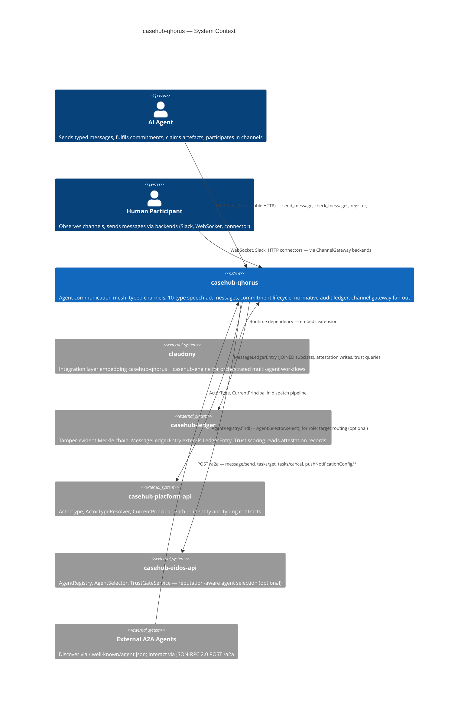
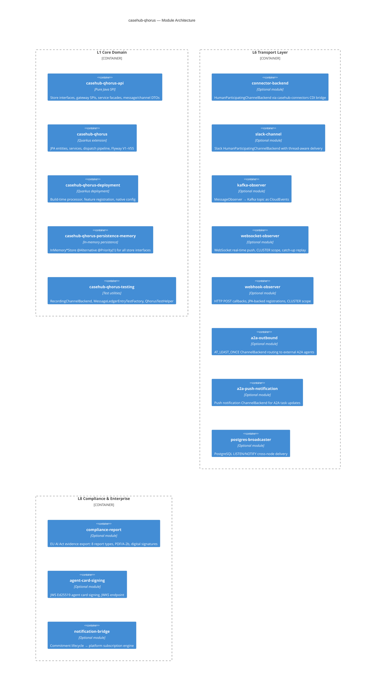
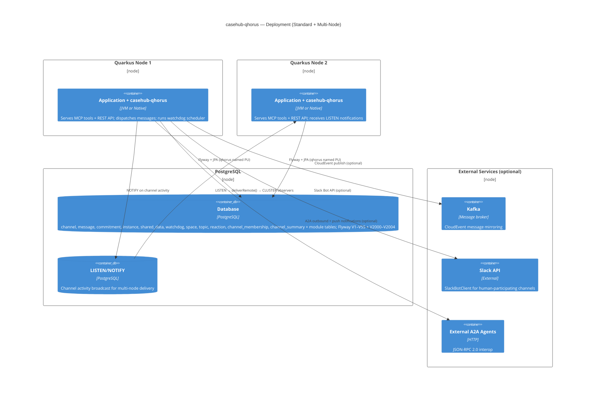

# CaseHub Qhorus — ARC42STORIES.MD

**Spec:** Arc42Stories v0.1
**Profile:** CaseHub — Foundation tier
**Profile ref:** `../parent/docs/arc42stories-casehub-profile.md` · fallback: `https://raw.githubusercontent.com/casehubio/parent/main/docs/arc42stories-casehub-profile.md`
**Build position:** Foundation — depends on `casehub-platform-api` and `casehub-ledger`; no other casehubio dependencies
**Consumed by:** `claudony` (integration layer)
**Depends on:** `casehub-platform-api` (compile, `api/` module), `casehub-ledger` (compile, runtime + optional modules)

---

## §1 Introduction and Goals

### Description

Qhorus is a Quarkus-based agent communication mesh and the peer-to-peer coordination layer for multi-agent AI systems. More precisely, it is a governance methodology — not middleware. It gives every agent interaction the formal status of an accountable act, grounded in speech act theory, deontic logic, defeasible reasoning, and social commitment semantics. The LLM reasons; the infrastructure enforces, records, and derives.

Any Quarkus app adds `io.casehub:casehub-qhorus` as a dependency and its agents get: typed channels with declared update semantics (APPEND, COLLECT, BARRIER, EPHEMERAL, LAST_WRITE); typed messages via a 10-type speech-act taxonomy (QUERY, COMMAND, RESPONSE, STATUS, DECLINE, HANDOFF, DONE, FAILURE, PROPOSE, EVENT); a shared data store with artefact lifecycle management; an instance registry with capability tags and three addressing modes; commitment-tracked obligation lifecycle; normative audit via a tamper-evident Merkle ledger; and channel gateway fan-out across pluggable transport backends.

Qhorus has no dependency on CaseHub or Claudony — it is the independent communication layer.

### Stakeholders

| Stakeholder | Interest |
|---|---|
| Quarkus app developer | Embeds the extension; configures `casehub.qhorus.*` properties; wires CDI beans; implements backend SPIs |
| Consumer repo (claudony) | Integrates qhorus as the agent mesh layer; combines with casehub-engine for orchestration |
| AI agent | Sends and receives typed messages; fulfils commitments; claims artefacts; participates in channels |
| A2A ecosystem | Discovers agents via `/.well-known/agent.json`; interacts via JSON-RPC 2.0 at `POST /a2a` |
| Platform team | Maintains speech-act contracts, SPI stability, ledger integrity, and cross-repo protocol compliance |

### Quality Goals

| Priority | Goal | Scenario |
|---|---|---|
| 1 | Commitment lifecycle correctness | A COMMAND dispatched to a channel opens an obligation that is fulfilled, declined, or expired within one scheduler cycle — no silent drops |
| 2 | Isolation | The core extension compiles and passes unit tests without `casehub-engine`, `claudony`, or any application-tier repo on the classpath |
| 3 | Zero-datasource unit testing | `MessageServiceTest` runs without Quarkus boot via `InMemoryMessageStore`, completing in under 1 s |

### Artifact Schema

| Artifact type | Format | Example | Where it lives |
|---|---|---|---|
| Issue | `#NNN` or `casehubio/qhorus#NNN` | `#456` | GitHub Issues |
| ADR | `ADR-NNNN` | `ADR-0005` | `docs/adr/` |
| Garden entry | `GE-YYYYMMDD-XXXXXX` | `GE-20260618-d81cef` | `~/.hortora/garden/` |
| Protocol | `PP-YYYYMMDD-XXXXXX` | `PP-20260608-054090` | `docs/protocols/casehub/` |
| Design spec | `YYYY-MM-DD-topic-design` | `2026-04-13-qhorus-design` | `docs/specs/` |

---

## §2 Constraints

### Platform

| Constraint | Value |
|---|---|
| Java | 21 language level, running on JVM 26 |
| Framework | Quarkus 3.32.2 |
| MCP transport | `quarkus-mcp-server-http` 1.11.1 (Streamable HTTP, MCP spec 2025-06-18) |
| Native target | GraalVM 25 |
| Build | `JAVA_HOME=$(/usr/libexec/java_home -v 26) mvn clean install` — use `mvn`, not `./mvnw` |

### Architectural Constraints

- Named 'qhorus' datasource: all JPA entities and Flyway migrations use a dedicated named persistence unit, isolating qhorus schema from other extensions on the same classpath
- Flyway path scoping: all migrations at `classpath:db/qhorus/migration/`; domain tables V1–V55; ledger subclass join at V2000+
- Config prefix: `casehub.qhorus.*` (not `quarkus.qhorus`)
- Zero casehubio core deps beyond `casehub-platform-api` and `casehub-ledger`: all other casehubio integrations are optional or in separate modules
- Module naming: short names (`api/`, `runtime/`, `deployment/`) — no repo-prefix repetition
- Test datasource: H2 `MODE=PostgreSQL` with `DB_CLOSE_DELAY=-1`; both default and qhorus named PUs require `database.generation=drop-and-create`

---

## §3 Context and Scope

### Boundary Rules

What casehub-qhorus explicitly does NOT do:

- Orchestrate case flow or interpret case plan state — that is `casehub-engine`
- Provision or lifecycle-manage AI agents — that is `claudony`
- Implement trust scoring algorithms — that is `casehub-ledger` (qhorus writes attestations; ledger computes trust)
- Manage human task lifecycles (claim, SLA, escalation) — that is `casehub-work`
- Define agent capabilities or persona mappings — that is `casehub-eidos`

### Platform References

- `docs/platform/dependency-map.md` — authoritative consumer list
- `docs/repos/qhorus.md` — platform deep-dive for this module
- `docs/specs/2026-04-13-qhorus-design.md` — original design specification
- `docs/agent-protocol-comparison.md` — A2A vs ACP vs Qhorus
- `docs/multi-agent-framework-comparison.md` — full multi-agent framework comparison

---

## §4 Solution Strategy

Foundation modules define their own layer taxonomy. Qhorus's layers represent the internal architectural concerns added incrementally across 55 build chapters:

### Layer Taxonomy

| Layer | Concern |
|---|---|
| L1 Core Domain | Channel, Message, Instance, SharedData entities; CRUD services; store interfaces; 5 channel semantics (APPEND, COLLECT, BARRIER, EPHEMERAL, LAST_WRITE) |
| L2 Speech Act Protocol | 10-type message taxonomy (ADR-0005); commitment lifecycle (7 states: OPEN→ACKNOWLEDGED→FULFILLED/DECLINED/FAILED/DELEGATED/EXPIRED); correlation integrity; dispatch pipeline; ObligorTrustPolicy |
| L3 Normative Audit | MessageLedgerEntry (all 10 types); CommitmentAttestationPolicy SPI; EvidentialChecker (Zone 1–3); peer attestation; AttestorCredibilityPolicy; CausalGraphService |
| L4 Channel Features | Topics (create, merge, move); reactions (idempotent); spaces (recursive nesting); membership (join/leave, unread counts); presence (Caffeine-based heartbeat); channel summaries (SummaryUpdateHook SPI); projections (left-fold SPI); delivery tracking (per-participant) |
| L5 Enforcement & Safety | Watchdog framework (8 condition types); ChannelProtocol SPI (4 built-in protocols); enforcement modes (ADVISORY/BLOCKING/QUARANTINE); DispatchAdvisory pipeline; containment actions; channel policy overrides |
| L6 Transport Layer | ChannelGateway (backend-agnostic fan-out); backend impls (qhorus-internal, connector, Slack, A2A outbound, push notification); MessageObserver SPI (LOCAL/CLUSTER scope); observer impls (in-process CDI, Kafka, WebSocket, Webhook); DeliveryService (AT_LEAST_ONCE pump); postgres broadcaster (LISTEN/NOTIFY) |
| L7 API Surface | MCP tools (blocking); REST resources (channels, A2A JSON-RPC, agent cards, causal graphs, compliance); per-agent cards at `/.well-known/agents/{instanceId}.json` |
| L8 Compliance & Enterprise | Compliance report module (EU AI Act, 8 report types, PDF/A-2b + digital signatures); agent card signing (JWS Ed25519, JWKS endpoint); notification bridge (platform subscription engine); routing bridge (reputation-aware, role: targets); capacity signals |

### Chapter Sequencing Rationale

Hard dependencies — order is non-negotiable:

- L1 Core Domain before L2 Speech Act Protocol: commitment lifecycle requires channel + message entities
- L2 Speech Act Protocol before L3 Normative Audit: ledger entries record commitment state transitions
- L1 Core Domain before L6 Transport Layer: gateway fans out persisted messages
- L2 Speech Act Protocol before L5 Enforcement & Safety: protocol enforcement evaluates message types and commitment state
- L3 Normative Audit before L8 Compliance & Enterprise: compliance reports query ledger entries

---

## §5 Building Block View

### Module Index

| Folder | Artifact | Type | Purpose |
|---|---|---|---|
| `api/` | `casehub-qhorus-api` | Pure Java SPI | Store interfaces (6), gateway SPIs (ChannelBackend, MessageObserver, InboundNormaliser), service facades (ChannelManager, MessageDispatcher), message/channel DTOs, CommitmentAttestationPolicy SPI |
| `runtime/` | `casehub-qhorus` | Quarkus extension | JPA entities (Channel, Message, Commitment, Instance, SharedData, Watchdog, Space, Topic, Reaction, ChannelMembership, ChannelSummary), services, dispatch pipeline, ledger integration, Flyway V1–V55 |
| `deployment/` | `casehub-qhorus-deployment` | Quarkus deployment | Build-time processor, feature registration, native image migration resource registration |
| `persistence-memory/` | `casehub-qhorus-persistence-memory` | In-memory persistence | InMemory*Store implementations for all store interfaces — `@Alternative @Priority(1)` for zero-config test isolation |
| `testing/` | `casehub-qhorus-testing` | Test utilities | RecordingChannelBackend, MessageLedgerEntryTestFactory, QhorusTestHelper |
| `connector-backend/` | `casehub-qhorus-connector-backend` | Optional bridge module | Routes InboundMessage CDI events from casehub-connectors into qhorus channel dispatch; ConnectorNormaliser SPI |
| `slack-channel/` | `casehub-qhorus-slack-channel` | Optional backend | HumanParticipatingChannelBackend via SlackBotClient; thread-aware delivery with composite in-memory + DB-backed cache |
| `kafka-observer/` | `casehub-qhorus-kafka-observer` | Optional observer | MessageObserver → Kafka topic as CloudEvents (LOCAL scope) |
| `websocket-observer/` | `casehub-qhorus-websocket-observer` | Optional observer | WebSocket real-time push (CLUSTER scope); catch-up replay via lastEventId |
| `webhook-observer/` | `casehub-qhorus-webhook-observer` | Optional observer | HTTP POST callbacks (CLUSTER scope); JPA-backed registrations; CredentialResolver for signing secrets |
| `a2a-outbound/` | `casehub-qhorus-a2a-outbound` | Optional bridge | AT_LEAST_ONCE ChannelBackend routing channel messages to external A2A agents via delivery pump |
| `a2a-push-notification/` | `casehub-qhorus-a2a-push-notification` | Optional backend | Push notification ChannelBackend for A2A task status updates; per-URL health tracking with exponential backoff |
| `compliance-report/` | `casehub-qhorus-compliance-report` | Optional module | EU AI Act compliance evidence export — 8 report types; format renderers (JSON, CSV, HTML, PDF/A-2b); digital signatures (PAdES + CAdES); property verification; scheduled generation |
| `agent-card-signing/` | `casehub-qhorus-agent-card-signing` | Optional module | JWS Ed25519 agent card signing; JCS canonicalization; JWKS endpoint; identity-verification trust dimension |
| `notification-bridge/` | `casehub-qhorus-notification-bridge` | Optional bridge | Commitment lifecycle → platform subscription engine via QhorusObligationEvent (SubscribableEvent) |
| `postgres-broadcaster/` | `casehub-qhorus-postgres-broadcaster` | Optional module | PostgreSQL LISTEN/NOTIFY cross-node backend delivery; self-notification filtering |
| `a2a-protocol/` | `casehub-a2a-protocol` | Pure Java library | Layer 0 A2A types: AgentCard, JsonRpcRequest, A2ATask, A2AMessage, A2APart (sealed) |
| `examples/type-system/` | — | Test module | Fast regression tests for the 10-type taxonomy (CI, no LLM) |
| `examples/normative-layout/` | — | Test module | Deterministic 3-channel NormativeChannelLayout tests (CI, no LLM) |
| `examples/agent-communication/` | — | Test module | Real LLM agent examples (Jlama); normative benchmark (Zone 1/2/3); activate with `-Pwith-llm-examples` |

### API Interface Taxonomy

Four categories across `api/`:

| Category | Package | Purpose |
|---|---|---|
| Data access (CRUD) | `api/store/` | Blocking store interfaces; consumers implement via JPA |
| Extension points | `api/spi/` | Consumer-replaceable policies — CommitmentAttestationPolicy, ObligorTrustPolicy, AttestorCredibilityPolicy, InstanceActorIdProvider |
| Integration contracts | `api/gateway/` | Consumer-implemented backends — AgentChannelBackend, HumanParticipatingChannelBackend, HumanObserverChannelBackend, MessageObserver, InboundNormaliser |
| Service facades | `api/channel/`, `api/message/` | Consumer-called — ChannelManager, MessageDispatcher; read-only, no implementation needed |

---

## §6 Runtime View

### Scenario 1 — Message dispatch pipeline

Actor calls `send_message` (MCP tool) or `messageService.dispatch(MessageDispatch)`. The dispatch pipeline is the single enforcement gate for all channel writes:

1. **Paused check** — channel must not be paused
2. **AllowedWritersPolicy** — sender must be in the channel's write ACL (or ACL is null = open)
3. **RateLimiter** — in-memory 60-second sliding window (per-channel + per-instance)
4. **RoutingBridge** — resolves `role:X` capability targets to specific agent instanceIds via eidos `AgentRegistry.find()` + `AgentSelector.select()`
5. **ObligorTrustPolicy** — for COMMAND + named non-prefixed target, checks obligor trust meets threshold
6. **MessageTypePolicy** — hard-enforces COMMAND/QUERY on typed channels (allowedTypes/deniedTypes); advisory for other types
7. **CorrelationIntegrityChecker** — advisory checks on inReplyTo, resolution type matching, obligor identity, cross-channel resolution
8. **ProtocolRegistry** — evaluates all registered ChannelProtocol beans; produces `List<DispatchAdvisory>`
9. **EnforcementGate** — applies channel enforcement mode (ADVISORY/BLOCKING/QUARANTINE) to accumulated advisories; exempts EVENTs, system senders, and obligation-resolving types
10. **LAST_WRITE** — same-sender overwrite semantics
11. **Persist** — `messageStore.put()` + `topicService.ensureExists()`
12. **Commitment open** — for COMMAND/QUERY/PROPOSE with correlationId, opens an obligation
13. **FanOut** — `channelGateway.fanOut()` to all registered backends
14. **LedgerWriteService.record** — writes MessageLedgerEntry + attestation (REQUIRES_NEW)
15. **MessageObserverDispatcher** — fires registered MessageObserver beans (after commit via JTA synchronization)

### Scenario 2 — Commitment lifecycle

A COMMAND dispatched with a `correlationId` opens a `Commitment` in OPEN state. The obligor acknowledges (→ACKNOWLEDGED), then sends DONE (→FULFILLED) or FAILURE (→FAILED) or DECLINE (→DECLINED). HANDOFF delegates to another agent (→DELEGATED, child OPEN created). `CommitmentService.expireOverdue()` runs on schedule and transitions past-deadline commitments to EXPIRED. Each terminal transition triggers `LedgerWriteService.writeAttestation()` — one on the COMMAND entry (requester trust), one on the terminal entry (obligor trust).

### Scenario 3 — A2A task streaming

External client sends `POST /a2a` with `message/send` JSON-RPC method and `Accept: text/event-stream`. `A2AResource.dispatchStream()` maps A2A message to qhorus `send_message`, registers an SSE consumer via `A2AChannelBackend.registerStream()`, and streams task status updates as SSE events. `A2ATaskStateMapper` maps MessageType → A2A task state (DONE→"completed", FAILURE→"failed", DECLINE→"canceled", STATUS/HANDOFF→"working"). SSE keepalives every 15s; max duration 1800s; orphan detection on disconnect.

### Scenario 4 — Watchdog evaluation cycle

`WatchdogScheduler` fires on `@Scheduled` interval. For each registered Watchdog, `WatchdogEvaluationService.evaluateAll()` evaluates the condition type: BARRIER_STUCK, LOOP_DETECTED, OBLIGATION_FAN_OUT, CONVERSATION_STALL, ECHO_CHAMBER, CONTEXT_PRESSURE, DELIVERY_LAG, CIRCULAR_DELEGATION. When a condition fires, `executeContainmentAction()` runs the configured action (ALERT, PAUSE_CHANNEL, DEREGISTER_AGENT, QUARANTINE). Notification channel is excluded from pause to prevent self-defeat.

### Scenario 5 — Channel gateway fan-out

After `MessageService.dispatch()` persists a message, `ChannelGateway.fanOut()` iterates all registered backends for that channel. BEST_EFFORT backends receive the message synchronously via `post()`. AT_LEAST_ONCE backends are signaled via `DeliverySignalQueue`; `DeliveryService` pump thread picks up the signal and calls `DeliveryBatchExecutor.deliverBatch()`. Per-participant delivery retry runs after the backend catches up — `retryLaggingParticipants()` queries members with `lastDeliveredMessageId` < backend cursor and calls `deliverTo()` for missed messages.

---

## §7 Deployment View

### Deployment Variants

| Variant | Add to classpath | Capability gained |
|---|---|---|
| Minimal (evaluation) | `casehub-qhorus` + H2 datasource | Full channel/message/commitment lifecycle, MCP tools, agent card |
| Standard | `casehub-qhorus` + PostgreSQL datasource | Production datasource, Flyway migrations |
| Full audit | + `casehub-ledger` | Tamper-evident Merkle chain, attestation, trust scoring |
| Multi-node | + `casehub-qhorus-postgres-broadcaster` | All nodes receive all channel activity via LISTEN/NOTIFY |
| Human channels | + `casehub-qhorus-connector-backend` or `casehub-qhorus-slack-channel` | Human-in-the-loop messaging via connectors or Slack |
| Full platform | + all optional modules | A2A outbound, push notifications, Kafka/WebSocket/Webhook observers, compliance reports, agent card signing, notification bridge |

---

## §8 Crosscutting Concepts

### Convention References

| Concern | Protocol |
|---|---|
| Flyway path scoping | `qhorus-flyway-consumer-versioning` — all migrations at `db/qhorus/migration/`; consumers set Flyway location explicitly |
| CDI displacement | `@DefaultBean` displaced by `@Alternative @Priority(1)` via classpath presence |
| SPI placement | Consumer-facing SPIs in `api/spi/`; `@DefaultBean` impls in `runtime/` when JPA or config deps apply |
| Optional module JPA registration | `optional-module-jpa-package-registration` — consumer must append optional module packages to `quarkus.hibernate-orm.qhorus.packages` |
| Channel dual-identity resolution | `channel-dual-identity` — UUID or slug at the resource boundary; resolve once, pass UUID internally |
| System sender trust exemption | `system-sender-trust-exemption` — senders containing `:` bypass ObligorTrustPolicy |
| EVENT content invariant | `event-content-free-signal-type` — EVENT content is always null; telemetry goes in `dispatch.telemetry()` |
| Observer dispatch timing | `observer-test-transaction-discipline` — observers fire after commit via JTA `afterCompletion(STATUS_COMMITTED)` |
| Startup event isolation | `startup-event-handler-exception-isolation` — exception-isolated per channel in ChannelGateway startup recovery |
| Ledger sequence table init | `ledger-sequence-table-test-init` — test modules must include `import-qhorus-test.sql` for `ledger_subject_sequence` |
| Scheduled service tenancy | `scheduled-service-cross-tenant-stores` — background/scheduled services use `CrossTenant*Store` with `@QhorusSystem` principal |

### Anti-Patterns

**Symptom:** `MessageObserver.onMessage()` is never invoked in a `@TestTransaction` test, even though `messageService.dispatch()` succeeds and the message is persisted.
**Cause:** `MessageObserverDispatcher` defers dispatch to `afterCompletion(STATUS_COMMITTED)` via JTA `TransactionSynchronizationRegistry`. In a `@TestTransaction` test the transaction rolls back, so `afterCompletion` fires with `STATUS_ROLLEDBACK` and observers are silently skipped.
**Fix:** Use `QuarkusTransaction.requiringNew().run(() -> messageService.dispatch(...))` instead of `@TestTransaction`. Entity setup must also be committed first in a separate `requiringNew()` block. See GE-20260608-038af4 and PP-20260608-07daa6.

**Symptom:** An `InMemoryChannelStore.put()` call in a `@QuarkusTest` causes Hibernate to flush an unexpected INSERT to the database, even though the store never calls any Panache method.
**Cause:** Hibernate's bytecode enhancement dirty-tracks all field writes on `PanacheEntity` subclasses within an active Panache session — even for entities that were never persisted or loaded. The InMemory store modifies entity fields (e.g. `channel.lastActivityAt`) inside `Panache.withSession()` scope, triggering a phantom dirty flush.
**Fix:** InMemory store implementations must not mutate PanacheEntity fields in-place within session scope. Methods like `updateLastActivity()` must be no-ops in InMemory implementations; `put()` sets creation-time defaults sufficient for test contexts. See PP-20260618-100368, GE-20260618-d81cef.

**Symptom:** `CommitmentAttestationPolicy.attestationFor()` returns a verdict based on stale OPEN commitment state, even though the commitment was just fulfilled in the same dispatch.
**Cause:** `LedgerWriteService.record()` runs in `REQUIRES_NEW` — the outer transaction's commitment update is not yet committed when the ledger write runs. Querying `CommitmentStore` inside the REQUIRES_NEW boundary sees the old OPEN state.
**Fix:** `LedgerWriteService` does NOT query `CommitmentStore` — attestation verdict is derived from `MessageType` directly via `CommitmentAttestationPolicy`. The CommitmentStore query would see stale state. Integration tests for attestation must use `helper.sendMessage()` (not `messageService.dispatch()` directly).

**Symptom:** `@QuarkusTest` in a module that enables `casehub.ledger.enabled=true` fails at startup with `Table "LEDGER_SUBJECT_SEQUENCE" not found`.
**Cause:** `ledger_subject_sequence` is NOT a JPA entity — Hibernate `drop-and-create` does not create it. The table is needed by `QhorusSequenceAllocator` for atomic sequence allocation.
**Fix:** All test modules that enable the ledger must include `import-qhorus-test.sql` (one `CREATE TABLE IF NOT EXISTS ledger_subject_sequence ...` statement) and set `quarkus.hibernate-orm.qhorus.sql-load-script=import-qhorus-test.sql`.

---

## §9 Journeys and Chapters

### §9.1 Journey Overview

| Journey | Description | Chapters | Status |
|---|---|---|---|
| J1 — Core Communication Mesh | Foundational mesh: entities, MCP tools, channel semantics, correlation, artefacts, addressing, agent card, A2A, HITL, ACL, ledger, persistence abstraction, reactive dual-stack | C1–C14 | ✅ Complete |
| J2 — Normative Governance | Commitment lifecycle, speech act taxonomy, normative audit ledger, commitment attestation, evidential checking, multi-tenancy | C15–C20 | ✅ Complete |
| J3 — Channel Gateway & Transport | Backend-agnostic fan-out, connector/Slack backends, MessageObserver SPI, Kafka/WebSocket/Webhook observers, delivery service, postgres broadcaster | C21–C27 | ✅ Complete |
| J4 — Channel Intelligence | Topics, reactions, artefact references, channel membership, spaces, presence, channel summaries, projections, delivery tracking, chunked uploads | C28–C37 | ✅ Complete |
| J5 — Operational Safety | Watchdog framework, coordination pathology conditions, context pressure, protocol enforcement SPI, enforcement modes, watchdog containment actions | C38–C44 | ✅ Complete |
| J6 — Trust, Compliance & Routing | Peer attestation, attestor credibility, causal graphs, PROPOSE message type, reputation-aware routing, compliance reports, agent card signing, A2A outbound, push notifications, notification bridge, channel policy overrides | C45–C55 | ✅ Complete |
| J7 — Mesh Relay & Agent Bridge | Standalone mesh relay node, agent-bridge channel backend, delivery pump integration, startup scripts, auto-registration | C56–C57 | ✅ Complete |

### §9.2 Chapter Index

| # | Chapter | Journey | Key issues | Status |
|---|---|---|---|---|
| C1 | Core Data Model + Services | J1 | Phase 1 | ✅ |
| C2 | MCP Tool Surface | J1 | Phase 2 | ✅ |
| C3 | Channel Semantics | J1 | Phase 3 | ✅ |
| C4 | Correlation + wait_for_reply | J1 | Phase 4 | ✅ |
| C5 | Artefacts | J1 | Phase 5 | ✅ |
| C6 | Addressing | J1 | Phase 6 | ✅ |
| C7 | Agent Card | J1 | Phase 7 | ✅ |
| C8 | A2A Compatibility | J1 | Phase 9 | ✅ |
| C9 | Human-in-the-Loop Controls | J1 | Phase 10 | ✅ |
| C10 | Access Control + Governance | J1 | Phase 11 | ✅ |
| C11 | Structured Observability | J1 | Phase 12 | ✅ |
| C12 | Persistence Abstraction | J1 | Phase 13, ADR-0002 | ✅ |
| C13 | Reactive Dual-Stack | J1 | Phase 14, #74–#80, ADR-0003 | ✅ |
| C14 | Documentation | J1 | Phase 15, #81 | ✅ |
| C15 | Commitment Lifecycle | J2 | #121 | ✅ |
| C16 | Speech Act Taxonomy | J2 | ADR-0005 | ✅ |
| C17 | Normative Audit Ledger | J2 | #123, #179 | ✅ |
| C18 | Commitment Attestation SPI | J2 | #123, #304 | ✅ |
| C19 | Evidential Checker | J2 | #303 | ✅ |
| C20 | Multi-Tenancy | J2 | #260, #265 | ✅ |
| C21 | Channel Gateway | J3 | #135 | ✅ |
| C22 | Connector Backend | J3 | #216 | ✅ |
| C23 | Slack Channel Backend | J3 | #261 | ✅ |
| C24 | MessageObserver SPI | J3 | #163 | ✅ |
| C25 | Transport Observers | J3 | #279, #294 | ✅ |
| C26 | Delivery Service | J3 | #380 | ✅ |
| C27 | Postgres Broadcaster | J3 | — | ✅ |
| C28 | Topics | J4 | #329, #335, #336 | ✅ |
| C29 | Reactions | J4 | #330 | ✅ |
| C30 | Artefact References | J4 | #331 | ✅ |
| C31 | Channel Membership | J4 | #332, #379 | ✅ |
| C32 | Spaces | J4 | #334 | ✅ |
| C33 | Presence | J4 | #333 | ✅ |
| C34 | Channel Summaries | J4 | #355 | ✅ |
| C35 | Channel Projections | J4 | #232 | ✅ |
| C36 | Delivery Tracking | J4 | #376, #380 | ✅ |
| C37 | Chunked Artefact Upload | J4 | — | ✅ |
| C38 | Watchdog Framework | J5 | — | ✅ |
| C39 | Coordination Pathology Watchdogs | J5 | #354 | ✅ |
| C40 | Context Pressure + Delivery Lag | J5 | #363, #381 | ✅ |
| C41 | Circular Delegation Watchdog | J5 | #368 | ✅ |
| C42 | Protocol Enforcement SPI | J5 | #357 | ✅ |
| C43 | Enforcement Modes | J5 | #400 | ✅ |
| C44 | Watchdog Containment Actions | J5 | #399 | ✅ |
| C45 | Peer Attestation | J6 | #356 | ✅ |
| C46 | Attestor Credibility | J6 | #371 | ✅ |
| C47 | Causal Graph Service | J6 | #398 | ✅ |
| C48 | PROPOSE Message Type | J6 | #395 | ✅ |
| C49 | Reputation-Aware Routing | J6 | #401 | ✅ |
| C50 | Compliance Reports | J6 | #411, #414, #417, #418 | ✅ |
| C51 | Agent Card Signing | J6 | #403 | ✅ |
| C52 | A2A Outbound + Push Notifications | J6 | #396, #406 | ✅ |
| C53 | Notification Bridge | J6 | #375 | ✅ |
| C54 | Capacity Signals | J6 | #434 | ✅ |
| C55 | Channel Policy Overrides | J6 | #455 | ✅ |
| C56 | Mesh Relay Module | J7 | #465, #470 | ✅ |
| C57 | Agent Bridge Backend | J7 | #465, #471 | ✅ |

### Layer x Chapter Matrix

**J1 (C1-C14):**

| Layer | C1 | C2 | C3 | C4 | C5 | C6 | C7 | C8 | C9 | C10 | C11 | C12 | C13 | C14 |
|---|---|---|---|---|---|---|---|---|---|---|---|---|---|---|
| L1 Core Domain | **H** | — | **H** | — | **H** | **H** | — | — | **M** | **H** | — | **H** | **H** | — |
| L2 Speech Act Protocol | — | — | — | **H** | — | **M** | — | — | — | — | — | — | — | — |
| L3 Normative Audit | — | — | — | — | — | — | — | — | — | — | **H** | — | — | — |
| L4 Channel Features | — | — | — | — | — | — | — | — | — | — | — | — | — | — |
| L5 Enforcement & Safety | — | — | — | — | — | — | — | — | **M** | — | — | — | — | — |
| L6 Transport Layer | — | — | — | — | — | — | — | — | — | — | — | — | — | — |
| L7 API Surface | — | **H** | — | — | — | — | **H** | **H** | — | — | — | — | — | — |
| L8 Compliance & Enterprise | — | — | — | — | — | — | — | — | — | — | — | — | — | — |

**J2 (C15-C20):**

| Layer | C15 | C16 | C17 | C18 | C19 | C20 |
|---|---|---|---|---|---|---|
| L1 Core Domain | — | — | — | — | — | **M** |
| L2 Speech Act Protocol | **H** | **H** | — | — | — | L |
| L3 Normative Audit | — | — | **H** | **H** | **M** | **M** |
| L4 Channel Features | — | — | — | — | — | — |
| L5 Enforcement & Safety | — | — | — | — | — | — |
| L6 Transport Layer | — | — | — | — | — | — |
| L7 API Surface | — | — | — | — | — | L |
| L8 Compliance & Enterprise | — | — | — | — | — | — |

**J3 (C21-C27):**

| Layer | C21 | C22 | C23 | C24 | C25 | C26 | C27 |
|---|---|---|---|---|---|---|---|
| L1 Core Domain | L | — | — | — | — | — | — |
| L2 Speech Act Protocol | — | — | — | — | — | — | — |
| L3 Normative Audit | — | — | — | — | — | — | — |
| L4 Channel Features | — | — | — | — | — | L | — |
| L5 Enforcement & Safety | — | — | — | — | — | — | — |
| L6 Transport Layer | **H** | **M** | **H** | **H** | **H** | **H** | **H** |
| L7 API Surface | — | — | — | — | — | — | — |
| L8 Compliance & Enterprise | — | — | — | — | — | — | — |

**J4 (C28-C37):**

| Layer | C28 | C29 | C30 | C31 | C32 | C33 | C34 | C35 | C36 | C37 |
|---|---|---|---|---|---|---|---|---|---|---|
| L1 Core Domain | — | — | **M** | — | — | — | — | — | — | **M** |
| L2 Speech Act Protocol | — | — | — | — | — | — | — | — | — | — |
| L3 Normative Audit | — | — | — | — | — | — | — | — | — | — |
| L4 Channel Features | **H** | **M** | **M** | **H** | **H** | **M** | **H** | **H** | **H** | — |
| L5 Enforcement & Safety | — | — | — | — | — | — | — | — | — | — |
| L6 Transport Layer | — | — | — | — | — | — | — | — | **M** | — |
| L7 API Surface | — | — | — | — | — | — | — | — | — | — |
| L8 Compliance & Enterprise | — | — | — | — | — | — | — | — | — | — |

**J5 (C38-C44):**

| Layer | C38 | C39 | C40 | C41 | C42 | C43 | C44 |
|---|---|---|---|---|---|---|---|
| L1 Core Domain | — | — | — | — | — | — | — |
| L2 Speech Act Protocol | — | — | — | — | — | — | — |
| L3 Normative Audit | — | — | — | — | — | — | — |
| L4 Channel Features | — | — | — | — | — | — | — |
| L5 Enforcement & Safety | **H** | **H** | **M** | **M** | **H** | **H** | **H** |
| L6 Transport Layer | — | — | — | — | — | — | — |
| L7 API Surface | — | — | — | — | — | — | — |
| L8 Compliance & Enterprise | — | — | — | — | — | — | — |

**J6 (C45-C55):**

| Layer | C45 | C46 | C47 | C48 | C49 | C50 | C51 | C52 | C53 | C54 | C55 |
|---|---|---|---|---|---|---|---|---|---|---|---|
| L1 Core Domain | — | — | — | — | — | L | — | — | — | L | — |
| L2 Speech Act Protocol | — | — | — | **H** | **M** | — | — | — | — | — | — |
| L3 Normative Audit | **H** | **H** | **H** | — | L | **M** | — | — | — | — | — |
| L4 Channel Features | — | — | — | — | — | — | — | — | — | — | — |
| L5 Enforcement & Safety | — | — | — | — | — | — | — | — | — | — | **H** |
| L6 Transport Layer | — | — | — | — | — | — | — | **H** | — | — | — |
| L7 API Surface | L | — | L | — | — | — | **M** | **M** | — | — | L |
| L8 Compliance & Enterprise | — | — | — | — | **H** | **H** | **H** | **M** | **H** | **M** | — |

**J7 (C56-C57):**

| Layer | C56 | C57 |
|---|---|---|
| L1 Core Domain | L | **M** |
| L2 Speech Act Protocol | — | **M** |
| L3 Normative Audit | — | — |
| L4 Channel Features | — | — |
| L5 Enforcement & Safety | — | — |
| L6 Transport Layer | **H** | **H** |
| L7 API Surface | **H** | L |
| L8 Compliance & Enterprise | — | — |

---

## §9.3 Journey 1 — Core Communication Mesh (C1–C14)

> Journey 1 delivers the agent communication mesh from zero to a native-image-ready Quarkus extension with MCP tools, five channel semantics, correlation tracking, artefact lifecycle, three addressing modes, A2A compatibility, human-in-the-loop controls, access governance, structured ledger observability, a persistence abstraction layer, and a reactive dual-stack. All 14 chapters were completed between 2026-04-13 and 2026-04-21.

---

### Chapter C1 — Core Data Model + Services

**Journey:** J1 — Core Communication Mesh | **Sequence:** 1 of 14 | **Status:** ✅
**Delivered:** 2026-04-14 | **Issues:** Phase 1

**What this delivers**
Before this chapter, no agent communication primitive existed in the qhorus codebase. After: four Panache entities — `Channel` (with `ChannelSemantic` enum), `Message` (sequence PK for ordering), `Instance` (agent registry with capability tags), and `SharedData` (key-value artefact store with chunked upload) — are in place with UUID primary keys set in `@PrePersist`. Five `@ApplicationScoped` services provide the domain API: `ChannelService` (create, find, list), `MessageService` (send, poll, find), `InstanceService` (register/upsert with capability replacement, heartbeat, stale detection), `DataService` (store, get, list), and a shared `Flyway V1` migration establishing the schema. Any Quarkus application adding `casehub-qhorus` gets a working agent communication mesh backed by its configured datasource. 33 tests validate the domain layer.

**Accountability gaps closed**
- None — foundational infrastructure; no prior accountability surface existed

**Layer Impact**
| Layer | Delta |
|---|---|
| L1 Core Domain | High |

---

### Chapter C2 — MCP Tool Surface

**Journey:** J1 — Core Communication Mesh | **Sequence:** 2 of 14 | **Status:** ✅
**Delivered:** 2026-04-14 | **Issues:** Phase 2, #8–#11

**What this delivers**
Before this chapter, the domain services were accessible only via CDI injection — no external tool exposure existed. After: `QhorusMcpTools` (`@ApplicationScoped`) exposes 14 `@Tool` methods at the `/mcp` Streamable HTTP endpoint covering instance management (`register`, `list_instances`), channel management (`create_channel`, `list_channels`, `find_channel`), messaging (`send_message`, `check_messages`, `get_replies`, `search_messages`), and shared data (`share_data`, `get_shared_data`, `list_shared_data`, `claim_artefact`, `release_artefact`). Eight structured return-type records (`RegisterResponse`, `ChannelDetail`, `DispatchResult`, `CheckResult`, etc.) provide reliable programmatic field access for AI agents. Test count reaches 87.

**Accountability gaps closed**
- None — capability addition exposing existing services to MCP consumers

**Layer Impact**
| Layer | Delta |
|---|---|
| L7 API Surface | High |

---

### Chapter C3 — Channel Semantics

**Journey:** J1 — Core Communication Mesh | **Sequence:** 3 of 14 | **Status:** ✅
**Delivered:** 2026-04-14 | **Issues:** Phase 3

**What this delivers**
Before this chapter, channels stored messages but had no enforcement of update semantics — all channels behaved as simple append logs regardless of their declared semantic. After: the `ChannelSemantic` enum's five modes are enforced in `checkMessages`: APPEND and LAST_WRITE use standard cursor-based polling; EPHEMERAL fetches messages then deletes them atomically for single-consumer delivery; COLLECT fetches ALL non-EVENT messages and clears the channel atomically; BARRIER blocks until all `barrierContributors` have sent a non-EVENT message, then delivers all and clears. LAST_WRITE enforces same-sender overwrites in `send_message` — a different sender throws `IllegalStateException`. Dedicated semantic test classes (`LastWriteSemanticTest`, `EphemeralSemanticTest`, `CollectSemanticTest`, `BarrierSemanticTest`) verify each contract in isolation. Test count reaches 117.

**Accountability gaps closed**
- No semantic enforcement → channel update semantics enforced at the message dispatch and read boundaries

**Layer Impact**
| Layer | Delta |
|---|---|
| L1 Core Domain | High |

---

### Chapter C4 — Correlation + wait_for_reply

**Journey:** J1 — Core Communication Mesh | **Sequence:** 4 of 14 | **Status:** ✅
**Delivered:** 2026-04-14 | **Issues:** Phase 4

**What this delivers**
Before this chapter, agents had no way to issue a request and wait for a correlated response — all communication was fire-and-forget. After: `PendingReply` entity tracks `wait_for_reply` correlations with `instanceId`, `channelId`, and `expiresAt`; the `wait_for_reply` MCP tool long-polls with SSE keepalives until a response matching the `correlationId` arrives or the deadline expires; `send_message` auto-generates a `correlationId` for QUERY and COMMAND types. Correlation isolation tests verify that responses are delivered only to the correct waiting instance and that expired waits are cleaned up. Note: `PendingReply` was later superseded by `CommitmentStore` in Journey 2 (C15).

**Accountability gaps closed**
- None — infrastructure addition enabling request-response patterns

**Layer Impact**
| Layer | Delta |
|---|---|
| L2 Speech Act Protocol | High |

---

### Chapter C5 — Artefacts

**Journey:** J1 — Core Communication Mesh | **Sequence:** 5 of 14 | **Status:** ✅
**Delivered:** 2026-04-14 | **Issues:** Phase 5

**What this delivers**
Before this chapter, `SharedData` existed as a simple key-value store with no lifecycle management — artefacts could accumulate indefinitely with no garbage collection eligibility. After: `ArtefactClaim` entity implements a claim/release lifecycle; `claim_artefact` prevents GC while claimed, `release_artefact` makes artefacts GC-eligible when all claims are released; `DataService.isGcEligible()` requires `complete = true AND claimCount = 0`. The `artefact_refs` field on `Message` wires artefact references through the MCP message flow, enabling agents to attach data references to messages. `send_message` with `artefact_refs` auto-claims each artefact on behalf of the sender; sending DONE/FAILURE/DECLINE auto-releases. GC lifecycle tests validate the full claim/release/eligibility contract.

**Accountability gaps closed**
- No artefact lifecycle tracking → claim/release lifecycle with GC eligibility gate

**Layer Impact**
| Layer | Delta |
|---|---|
| L1 Core Domain | High |

---

### Chapter C6 — Addressing

**Journey:** J1 — Core Communication Mesh | **Sequence:** 6 of 14 | **Status:** ✅
**Delivered:** 2026-04-14 | **Issues:** Phase 6

**What this delivers**
Before this chapter, all messages in a channel were visible to all readers — no targeting or filtering mechanism existed. After: the `target` field on `Message` supports three addressing modes: by instance ID (exact match), by capability tag (`capability:tag`), and by role (`role:name`). The read side filters messages via `isVisibleToReader` — only the targeted instance (or instances with the matching capability/role) see the message. EVENT messages bypass targeting entirely (always visible to all observers). BARRIER semantics interact correctly with role-based targeting — a barrier contributor addressed by role is counted when any instance filling that role has contributed. 41 new tests cover all three addressing modes plus EVENT bypass and BARRIER+role interactions.

**Accountability gaps closed**
- None — capability addition enabling directed messaging

**Layer Impact**
| Layer | Delta |
|---|---|
| L1 Core Domain | High |
| L2 Speech Act Protocol | Med |

---

### Chapter C7 — Agent Card

**Journey:** J1 — Core Communication Mesh | **Sequence:** 7 of 14 | **Status:** ✅
**Delivered:** 2026-04-14 | **Issues:** Phase 7

**What this delivers**
Before this chapter, there was no standardised way for external systems to discover what agents a qhorus deployment hosts or what capabilities they offer. After: `AgentCardResource` serves `GET /.well-known/agent.json` returning an A2A-compatible directory card with authentication configuration and an `agents[]` array listing all registered instances. Per-agent cards at `GET /.well-known/agents/{instanceId}.json` provide individual agent metadata from the Instance registry. The card includes a `tenancyId` field (qhorus-specific extension to the A2A AgentCard schema) reflecting `currentPrincipal.tenancyId()`, allowing A2A orchestrators to discover which tenant context a card represents. 22 tests validate card generation, per-agent lookup, and tenant scoping.

**Accountability gaps closed**
- None — capability addition enabling ecosystem discovery

**Layer Impact**
| Layer | Delta |
|---|---|
| L7 API Surface | High |

---

### Chapter C8 — A2A Compatibility

**Journey:** J1 — Core Communication Mesh | **Sequence:** 8 of 14 | **Status:** ✅
**Delivered:** 2026-04-14 | **Issues:** Phase 9

**What this delivers**
Before this chapter, agents could interact with qhorus only via MCP tools — no standard inter-agent protocol endpoint existed. After: `A2AResource` implements JSON-RPC 2.0 dispatch at `POST /a2a` with two JAX-RS methods: `dispatch()` for synchronous responses (routes `message/send`, `tasks/get`, `tasks/cancel`) and `dispatchStream()` for SSE streaming (`message/send` only, via `Accept: text/event-stream`). Content negotiation via the Accept header selects between sync and streaming. The resource uses standard JSON-RPC error codes (-32601 method not found, -32602 invalid params) and maps qhorus message types to A2A task states. SSE keepalives run every 15 seconds with a max duration of 1800 seconds. Guarded by `casehub.qhorus.a2a.enabled` config. 29 tests cover dispatch, streaming, and error paths.

**Accountability gaps closed**
- None — interoperability addition for the A2A ecosystem

**Layer Impact**
| Layer | Delta |
|---|---|
| L7 API Surface | High |

---

### Chapter C9 — Human-in-the-Loop Controls

**Journey:** J1 — Core Communication Mesh | **Sequence:** 9 of 14 | **Status:** ✅
**Delivered:** 2026-04-14 | **Issues:** Phase 10

**What this delivers**
Before this chapter, once a channel was created and agents were communicating, humans had no intervention capabilities — no way to pause runaway conversations, gate agent actions, cancel stale waits, or clean up resources. After: eight MCP tools provide full HITL coverage: `pause_channel`/`resume_channel` halt and restart message dispatch; `request_approval`/`respond_to_approval`/`list_pending_approvals` implement a human approval gate; `cancel_wait`/`list_pending_waits` manage stale long-polls; `force_release_channel` bypasses BARRIER/COLLECT release conditions; `revoke_artefact` force-deletes SharedData and all claims; `delete_message`, `clear_channel`, `deregister_instance` provide cleanup operations; `channel_digest` generates structured channel summaries for human dashboards. An optional watchdog alerting module (`casehub.qhorus.watchdog.enabled`) provides condition-based alert registrations. 103 tests cover all HITL paths.

**Accountability gaps closed**
- No human override capability → pause/resume, approval gate, and cleanup operations enable human governance of agent communication

**Layer Impact**
| Layer | Delta |
|---|---|
| L1 Core Domain | Med |
| L5 Enforcement & Safety | Med |

---

### Chapter C10 — Access Control + Governance

**Journey:** J1 — Core Communication Mesh | **Sequence:** 10 of 14 | **Status:** ✅
**Delivered:** 2026-04-14 | **Issues:** Phase 11

**What this delivers**
Before this chapter, any registered instance could write to any channel and perform any management operation — no access control existed. After: four governance layers are in place. `allowed_writers` (V5 migration) is a per-channel write ACL — when set, `send_message` rejects senders not matching any entry (bare instance ID, `capability:tag`, or `role:name`); EVENT messages bypass. `admin_instances` (V6) is a per-channel management ACL enforced on `pause_channel`, `resume_channel`, `force_release_channel`, and `clear_channel`. `RateLimiter` (V7) provides an in-memory 60-second sliding window with per-channel and per-instance rate limits (messages/min); EVENT messages bypass. Observer mode (`ObserverRegistry`) enables read-only event subscriptions outside the instance registry — observer IDs cannot write to any channel and never appear in `list_instances`. 82 tests across all four governance layers.

**Accountability gaps closed**
- No write access control → `allowed_writers` ACL gate on every channel write
- No management access control → `admin_instances` gate on all management operations

**Layer Impact**
| Layer | Delta |
|---|---|
| L1 Core Domain | High |

---

### Chapter C11 — Structured Observability

**Journey:** J1 — Core Communication Mesh | **Sequence:** 11 of 14 | **Status:** ✅
**Delivered:** 2026-04-15 | **Issues:** Phase 12

**What this delivers**
Before this chapter, message dispatch had no structured audit trail — messages were persisted but not recorded in a tamper-evident ledger. After: `AgentMessageLedgerEntry` (renamed to `MessageLedgerEntry` in Journey 2) extends `casehub-ledger`'s `LedgerEntry` as a JOINED subclass (V1002 migration), recording structured EVENTs with tool_name, duration_ms, token_count, and context_refs fields. `LedgerWriteService` captures every EVENT dispatch in a `REQUIRES_NEW` transaction — a ledger write failure is swallowed with a warning; the message transaction is unaffected. Two MCP tools provide query access: `list_events` (channel/agent/time filters with cursor pagination) and `get_channel_timeline` (chronological view of all message types). 36 new tests bring the total to 557.

**Accountability gaps closed**
- No structured audit trail → `MessageLedgerEntry` appended for every EVENT dispatch via tamper-evident ledger

**Layer Impact**
| Layer | Delta |
|---|---|
| L3 Normative Audit | High |

---

### Chapter C12 — Persistence Abstraction

**Journey:** J1 — Core Communication Mesh | **Sequence:** 12 of 14 | **Status:** ✅
**Delivered:** 2026-04-18 | **Issues:** Phase 13, ADR-0002

**What this delivers**
Before this chapter, all services called Panache entity statics directly — no seam existed for alternative persistence backends, and unit tests required a running Quarkus boot with H2. After: five `*Store` interfaces define the persistence contract: `ChannelStore`, `MessageStore`, `InstanceStore`, `DataStore`, `WatchdogStore`. Each interface has a corresponding `*Query` value object with `matches()` predicates enabling portable query semantics. `Jpa*Store` implementations wrap Panache calls behind the interface. The `casehub-qhorus-persistence-memory` module provides `InMemory*Store` implementations (`@Alternative @Priority(1)`) for zero-config test isolation — consumers add it at test scope and get in-memory stores automatically with no database. The `testing/` module ships `RecordingChannelBackend` and `MessageLedgerEntryTestFactory`. 88 new tests bring the total to 646. See ADR-0002.

**Accountability gaps closed**
- None — infrastructure separation enabling alternative persistence backends

**Layer Impact**
| Layer | Delta |
|---|---|
| L1 Core Domain | High |

---

### Chapter C13 — Reactive Dual-Stack

**Journey:** J1 — Core Communication Mesh | **Sequence:** 13 of 14 | **Status:** ✅
**Delivered:** 2026-04-20 – 2026-04-21 | **Issues:** Phase 14, #74–#80, ADR-0003

**What this delivers**
Before this chapter, all services and stores were blocking-only — applications requiring reactive pipelines had to wrap blocking calls manually. After: five `Reactive*Store` interfaces mirror the blocking stores with `Uni<T>` returns; `ReactiveJpa*Store` implementations use Hibernate Reactive Panache; `InMemoryReactive*Store` wrappers delegate to the corresponding blocking InMemory stores via `Uni.createFrom().item(...)`. Five `Reactive*Service` classes (`ReactiveChannelService`, `ReactiveMessageService`, `ReactiveInstanceService`, `ReactiveDataService`, `ReactiveWatchdogService`) plus `ReactiveLedgerWriteService` mirror the blocking services. `QhorusMcpToolsBase` extraction (#76) moves 23 response records, 7 mappers, and 3 validators into a shared abstract base. `ReactiveQhorusMcpTools` exposes 39 tools returning `Uni<T>`. Build-time activation via `@IfBuildProperty`/`@UnlessBuildProperty` ensures only one stack is active. `ReactiveAgentCardResource` and `ReactiveA2AResource` complete the dual-stack. Contract test bases with `@Disabled` reactive runners are scaffolded for when Docker/PostgreSQL Dev Services becomes available. See ADR-0003.

**Accountability gaps closed**
- None — infrastructure addition enabling reactive deployment targets

**Layer Impact**
| Layer | Delta |
|---|---|
| L1 Core Domain | High |

---

### Chapter C14 — Documentation

**Journey:** J1 — Core Communication Mesh | **Sequence:** 14 of 14 | **Status:** ✅
**Delivered:** 2026-04-21 | **Issues:** Phase 15, #81

**What this delivers**
Before this chapter, the project had no comprehensive design document — architectural decisions were scattered across commit messages and issue descriptions. After: `docs/DESIGN.md` documents the component structure, technology stack, domain model, services, persistence abstraction, MCP tool surface, configuration, and build roadmap. ADR-0001 (MCP tool return type strategy), ADR-0002 (persistence abstraction), and ADR-0003 (reactive dual-stack) record the three major architectural decisions from Journey 1. `CLAUDE.md` is updated with testing conventions and build commands. Note: `docs/DESIGN.md` is superseded by this `ARC42STORIES.MD` document in #456.

**Accountability gaps closed**
- None — documentation infrastructure

**Layer Impact**
| Layer | Delta |
|---|---|
| Cross-cutting | — |

## §9.4 Journey 2 — Normative Governance (C15–C20)

> Journey 2 transforms Qhorus from a communication mesh into a normative governance layer. Messages gain formal obligation semantics via the Commitment entity, a 9-type speech-act taxonomy grounds message types in theory, and a tamper-evident audit ledger records every message with attestation verdicts. Evidential checking validates content against benchmark invariants, and multi-tenancy scopes all queries to a declared tenant. All 6 chapters were delivered between 2026-04-23 and 2026-06-10.

---

### Chapter C15 — Commitment Lifecycle

**Journey:** J2 — Normative Governance | **Sequence:** 1 of 6 | **Status:** ✅
**Delivered:** 2026-04-24 | **Issues:** #121

**What this delivers**
Before this chapter, messages were fire-and-forget — a COMMAND dispatched to a channel had no obligation tracking, no deadline enforcement, and no way to detect whether it was ever fulfilled. The `PendingReply` entity tracked only `wait_for_reply` correlation. After: the `Commitment` entity replaces `PendingReply` with a 7-state lifecycle (OPEN → ACKNOWLEDGED → FULFILLED / DECLINED / FAILED / DELEGATED / EXPIRED). `CommitmentService` enforces the state machine: `open()` on COMMAND/QUERY dispatch, `acknowledge()` on STATUS, `fulfill()` on DONE, `decline()` on DECLINE, `fail()` on FAILURE, `delegate()` on HANDOFF (creates parent DELEGATED + child OPEN). `expireOverdue()` runs on schedule and transitions past-deadline commitments to EXPIRED, firing `CommitmentExpiredEvent`. `CommitmentStore` provides cross-channel queries (`findOpenByObligor`, `findByCorrelationId`, `findByState`). Every agent interaction that creates an obligation now has a tracked, auditable lifecycle.

**Accountability gaps closed**
- No obligation tracking → `Commitment` entity with 7-state lifecycle and scheduled expiry
- Silent obligation drops → `CommitmentExpiredEvent` CDI event on timeout

**Layer Impact**
| Layer | Delta |
|---|---|
| L2 Speech Act Protocol | **H** |

---

### Chapter C16 — Speech Act Taxonomy

**Journey:** J2 — Normative Governance | **Sequence:** 2 of 6 | **Status:** ✅
**Delivered:** 2026-04-23 | **Issues:** ADR-0005

**What this delivers**
Before this chapter, Qhorus had a flat 6-type message enum with no theoretical grounding — types were ad-hoc labels chosen for convenience. After: the `MessageType` enum implements a 9-type speech-act taxonomy (QUERY, COMMAND, RESPONSE, STATUS, DECLINE, HANDOFF, DONE, FAILURE, EVENT) grounded in speech act theory, deontic logic, and social commitment semantics. ADR-0005 documents the theoretical foundation. Each type has formal properties: `requiresCorrelationId()` (QUERY, COMMAND true), `requiresContent()` (all except EVENT), `isAgentVisible()` (EVENT false — observer-only). `MessageDispatch.Builder.build()` enforces these invariants at construction time. The taxonomy drives the entire commitment lifecycle — COMMAND/QUERY open obligations, DONE/FAILURE/DECLINE resolve them, HANDOFF delegates, RESPONSE answers, STATUS reports progress, and EVENT carries telemetry outside the normative layer.

**Accountability gaps closed**
- None (theoretical foundation — accountability mechanisms built on this in subsequent chapters)

**Layer Impact**
| Layer | Delta |
|---|---|
| L2 Speech Act Protocol | **H** |

---

### Chapter C17 — Normative Audit Ledger

**Journey:** J2 — Normative Governance | **Sequence:** 3 of 6 | **Status:** ✅
**Delivered:** 2026-04-27 | **Issues:** #123, #179

**What this delivers**
Before this chapter, the ledger recorded only EVENT-type telemetry messages via `AgentMessageLedgerEntry` — the 8 agent-visible message types had no ledger presence, meaning obligation creation, fulfillment, and failure left no tamper-evident trace. After: `MessageLedgerEntry` (JOINED subclass of `JpaLedgerEntry` from casehub-ledger) records ALL message types. `LedgerWriteService.record()` runs in `REQUIRES_NEW` — a ledger write failure logs a warning and is swallowed; the message transaction is unaffected. `QhorusLedgerEntryRepository` provides tenancy-scoped queries: `listEntries`, `findAllByCorrelationId`, `findAncestorChain` (50-hop depth limit), `findStalledCommands`, `countByOutcome`, `findEventsSince`. `QhorusSequenceAllocator` assigns atomic sequences via `MERGE INTO ledger_subject_sequence` in its own `REQUIRES_NEW`. Flyway migration V2000 creates the ledger subclass join table. The ledger is now the complete, immutable channel history — every speech act from every agent is recorded with SHA-256 tamper evidence.

**Accountability gaps closed**
- Partial audit (EVENT-only) → complete message-level normative audit trail for all 9 types
- No causal chain traversal → `findAncestorChain` walks `causedByEntryId` links to root

**Layer Impact**
| Layer | Delta |
|---|---|
| L3 Normative Audit | **H** |

---

### Chapter C18 — Commitment Attestation SPI

**Journey:** J2 — Normative Governance | **Sequence:** 4 of 6 | **Status:** ✅
**Delivered:** 2026-04-28 (extended through 2026-06-23) | **Issues:** #123, #304

**What this delivers**
Before this chapter, commitments were resolved (fulfilled, declined, failed) without any trust assessment — the system recorded the resolution but made no judgment about its quality. After: `CommitmentAttestationPolicy` (SPI in `api/spi/`) determines what `LedgerAttestation` to write when a message discharges a commitment. The 3-arg method `attestationFor(MessageType, String resolvedActorId, CommitmentContext)` receives the terminal type, the resolved actor identity, and a `CommitmentContext` carrying `correlationId`, `channelId`, `channelName`, `commitmentId`, `capabilityTag`, `artefactUuid`, and `expectedToken`. `StoredCommitmentAttestationPolicy` (default) returns SOUND/0.7 for DONE, FLAGGED/0.6 for FAILURE, FLAGGED/0.4 for DECLINE, FLAGGED/0.3 for RESPONSE (wrong vocabulary for a COMMAND obligation). `LedgerWriteService.writeAttestation()` writes TWO attestations per terminal message when requester ≠ obligor: one on the COMMAND entry (requester trust) and one on the terminal entry (obligor trust). Self-attestation guard prevents double-writing when they are the same actor.

**Accountability gaps closed**
- No trust assessment on obligation resolution → attestation on every terminal message
- No differentiation between fulfillment quality → verdict and confidence score per resolution type

**Layer Impact**
| Layer | Delta |
|---|---|
| L3 Normative Audit | **H** |

---

### Chapter C19 — Evidential Checker

**Journey:** J2 — Normative Governance | **Sequence:** 5 of 6 | **Status:** ✅
**Delivered:** 2026-06-23 | **Issues:** #303

**What this delivers**
Before this chapter, attestation verdicts were assigned based on message type alone — a DONE message always received SOUND/0.7 regardless of whether its content actually fulfilled the obligation. After: `EvidentialChecker` (`@DefaultBean @ApplicationScoped` in `runtime/audit/`) provides two entry points: `check(String messageType, String content, BenchmarkContext)` for the benchmark path (Zone 1–3 variant checks), and `checkObligation(String terminalType, CommitmentContext)` for the attestation path. The attestation path performs I_ec vocabulary checks (always), V1 ghost-artefact detection (when `context.artefactUuid()` is non-null), and V4 verification token scanning (when `context.expectedToken()` is non-null). `StoredCommitmentAttestationPolicy` integrates the checker — a DONE that fails evidential checks is downgraded from SOUND to FLAGGED. `BenchmarkContext` carries variant-specific ground truth for Zone 3 testing; `BenchmarkViolation` reports findings with invariant IDs (I_ec, I_df). The checker is injectable by any consumer — casehub-devtown uses it directly for pre-attestation evidential checks.

**Accountability gaps closed**
- Type-only attestation (no content verification) → content-level evidential checking downgrades DONE to FLAGGED on violation

**Layer Impact**
| Layer | Delta |
|---|---|
| L3 Normative Audit | **M** |

---

### Chapter C20 — Multi-Tenancy

**Journey:** J2 — Normative Governance | **Sequence:** 6 of 6 | **Status:** ✅
**Delivered:** 2026-06-09 | **Issues:** #260, #265

**What this delivers**
Before this chapter, all channels, messages, commitments, and ledger entries existed in a single global namespace — any query returned data from all consumers, and there was no isolation between tenants sharing the same Qhorus deployment. After: every domain entity gains a `tenancyId` column (Flyway V18–V21). `InboundTenancyContext` (`@RequestScoped`) is populated by `TenancyContextFilter` (`@Provider @PreMatching @Priority(100)`) from the `X-Tenancy-ID` HTTP header for ALL requests. `QhorusInboundCurrentPrincipal` (`@ApplicationScoped`) reads from `InboundTenancyContext` with `ContextNotActiveException` catch for background-thread safety (returns `DEFAULT_TENANT_ID`). `QhorusSystemCurrentPrincipal` (`@QhorusSystem`) provides `isCrossTenantAdmin()=true` for background/scheduler contexts via `CrossTenantProducer`. All JPA store queries filter by `tenancyId`; all `MessageLedgerEntryRepository` methods (except PK-based lookups) require an explicit `tenancyId` parameter. `X-Tenancy-ID` is a routing header, not a security boundary — OidcCurrentPrincipal from `casehub-platform-oidc` displaces it at `@Priority(100)` in production.

**Accountability gaps closed**
- No tenant isolation → per-query tenant scoping on all domain entities and ledger queries

**Layer Impact**
| Layer | Delta |
|---|---|
| L1 Core Domain | **M** |
| L2 Speech Act Protocol | L |
| L3 Normative Audit | **M** |
| L7 API Surface | L |

## §9.5 Journey 3 — Channel Gateway & Transport (C21–C27)

> Journey 3 delivers the transport abstraction layer that decouples message persistence from message delivery. Before this journey, dispatched messages lived in the database with no pluggable fan-out — consumers received messages only through direct MCP tool polling. After: ChannelGateway provides backend-agnostic fan-out, five backend implementations bridge human participants (connectors, Slack) and external systems (Kafka, WebSocket, Webhook), an AT_LEAST_ONCE delivery pump with per-participant retry guarantees no message loss for push backends, and PostgreSQL LISTEN/NOTIFY propagates channel activity across cluster nodes. All 7 chapters were completed between 2026-05-05 and 2026-08-09.

---

### Chapter C21 — Channel Gateway

**Journey:** J3 — Channel Gateway & Transport | **Sequence:** 1 of 7 | **Status:** ✅
**Delivered:** 2026-05-05 | **Issues:** #131, #135, ADR-0006, ADR-0008

**What this delivers**
Before this chapter, messages were persisted by `MessageService` and retrieved by agents polling `check_messages` — there was no transport abstraction and no way for external systems to receive messages without polling. After: `ChannelGateway` provides backend-agnostic fan-out via a registry of `ChannelBackend` implementations. Three SPI interfaces in `api/gateway/` define the contract: `AgentChannelBackend` (agent-to-agent), `HumanParticipatingChannelBackend` (bidirectional human messaging with inbound normalisation via `InboundNormaliser`), and `HumanObserverChannelBackend` (read-only observation). `QhorusChannelBackend` ships as the default internal backend (deliberate no-op `post()` since persistence already happened in dispatch). `ChannelGateway.initChannel()` fires `ChannelInitialisedEvent` unconditionally — on channel creation and on startup recovery — so external backends observe it via `@Observes` to self-register without implementing their own restart logic (ADR-0008). `OutboundMessage` carries `messageId`, `sender`, `type`, `content`, `correlationId`, `inReplyTo`, `senderActorType`, `artefactRefs`, and `target` for full downstream context.

**Accountability gaps closed**
- No transport audit trail → every fan-out is preceded by a persisted `Message` row; the gateway never delivers a message that isn't in the database

**Layer Impact**
| Layer | Delta |
|---|---|
| L6 Transport Layer | High |
| L1 Core Domain | Low |

---

### Chapter C22 — Connector Backend

**Journey:** J3 — Channel Gateway & Transport | **Sequence:** 2 of 7 | **Status:** ✅
**Delivered:** 2026-06-25 | **Issues:** #216

**What this delivers**
Before this chapter, `casehub-connectors` (the platform's inbound message pipeline for email, SMS, and webhook sources) had no bridge into qhorus channels — human messages from connectors could not participate in agent conversations. After: the `connector-backend/` optional module provides `ConnectorChannelBackend` (a `HumanParticipatingChannelBackend`) that observes `InboundMessage` CDI events from casehub-connectors and routes them into qhorus channels via `ChannelGateway.receiveHumanMessage()`. `ConnectorNormaliser` SPI (extending `InboundNormaliser`, keyed by `connectorId()`) allows per-connector translation — email threading, type inference, metadata extraction. `ConnectorQhorusMeshBridge` implements the `ConnectorMeshBridge` SPI to post `STATUS` events back to a delivery channel after each MCP connector delivery, providing bidirectional observability. The module activates by classpath presence with no consumer configuration.

**Accountability gaps closed**
- None — integration bridge; accountability belongs to the message once it enters the qhorus dispatch pipeline

**Layer Impact**
| Layer | Delta |
|---|---|
| L6 Transport Layer | Med |

---

### Chapter C23 — Slack Channel Backend

**Journey:** J3 — Channel Gateway & Transport | **Sequence:** 3 of 7 | **Status:** ✅
**Delivered:** 2026-06-20 | **Issues:** #261

**What this delivers**
Before this chapter, human participants could interact with agent channels only through the connector backend (which required casehub-connectors on the classpath) — there was no native Slack integration. After: the `slack-channel/` optional module provides `SlackChannelBackend` (a `HumanParticipatingChannelBackend`) that delivers agent messages to Slack threads via `SlackBotClient` and receives human replies via `SlackInboundNormaliser`. Thread continuity is maintained by a composite cache: an in-memory `ConcurrentHashMap` for hot-path lookup backed by a JPA-persisted `SlackThreadCacheEntity` (keyed by `channelId + correlationId`) for durability across restarts. `SlackBotBinding` links qhorus channels to Slack channels, managed via `SlackBindingResource` (PUT/GET/DELETE). Slash-command detection in the normaliser maps Slack `/commands` to qhorus COMMAND messages. V23 and V24 migrations create the binding and thread cache tables. A `@Scheduled` TTL eviction job cleans thread cache entries older than 30 days.

**Accountability gaps closed**
- None — transport backend; message accountability is handled by the qhorus dispatch pipeline

**Layer Impact**
| Layer | Delta |
|---|---|
| L6 Transport Layer | High |

---

### Chapter C24 — MessageObserver SPI

**Journey:** J3 — Channel Gateway & Transport | **Sequence:** 4 of 7 | **Status:** ✅
**Delivered:** 2026-07-13 | **Issues:** #163

**What this delivers**
Before this chapter, post-dispatch notification was limited to `InProcessMessageBus` — a `@DefaultBean` that fired `CDI Event<MessageReceivedEvent>` asynchronously on the local JVM. There was no way for observers to declare topology intent, and multi-node deployments silently dropped events for nodes that didn't originate the message. After: `MessageObserver` (`@FunctionalInterface` in `api/gateway/`) gains an explicit `Scope { LOCAL, CLUSTER }` enum. LOCAL fires on the dispatching node only (zero serialisation, zero network); CLUSTER fires on ALL nodes — the dispatching node via `MessageObserverDispatcher.dispatch()`, remote nodes via `ChannelGateway.deliverRemote()` → `MessageService.dispatchClusterObservers()`. Observers may use any CDI scope (`@ApplicationScoped`, `@RequestScoped`, `@Dependent`); the dispatcher closes each `Instance.Handle` in a `finally` block. `MessageReceivedEvent` is a plain record carrying `messageId`, `channelName`, `channelId`, `tenancyId`, `messageType`, `senderId`, `correlationId`, `occurredAt`, and `content` — null for EVENT type. The `fromMessage()` static factory eliminates duplication between dispatcher and WebSocket catch-up replay.

**Accountability gaps closed**
- Node-asymmetric observer behaviour → CLUSTER scope makes topology intent explicit; observers fire symmetrically across the cluster

**Layer Impact**
| Layer | Delta |
|---|---|
| L6 Transport Layer | High |

---

### Chapter C25 — Transport Observers

**Journey:** J3 — Channel Gateway & Transport | **Sequence:** 5 of 7 | **Status:** ✅
**Delivered:** 2026-06-20 (CloudEvent adapter), 2026-07-13 (observer modules) | **Issues:** #279, #294, #163

**What this delivers**
Before this chapter, the only `MessageObserver` implementation was `InProcessMessageBus` — CDI async events on the local JVM. After: three optional observer modules ship, each implementing `MessageObserver` with different transport characteristics. **kafka-observer** publishes `MessageReceivedEvent` as CloudEvents to a Kafka topic (LOCAL scope — fire once per cluster). **websocket-observer** pushes events to browser clients in real time (CLUSTER scope — fire on all nodes); supports catch-up replay via `lastEventId` query param on `/qhorus/ws/channels/{channelId}` with server-side buffering during catch-up. **webhook-observer** posts HTTP callbacks to registered URLs (CLUSTER scope); JPA-backed persistent registrations survive restarts; `secretRef` resolved via `CredentialResolver` for HMAC signing (fail-closed on resolution failure). `CloudEventMapper` is a shared public utility that converts `MessageReceivedEvent` to CloudEvent format — used by both kafka-observer and the `QhorusCloudEventAdapter` (which bridges to the CloudEvents CDI bus without coupling observers to qhorus types). The adapter uses `event.occurredAt()` (message persist time) as the CloudEvent timestamp — not `OffsetDateTime.now()` (#294 fix).

**Accountability gaps closed**
- None — transport infrastructure; message accountability is handled upstream in the dispatch pipeline

**Layer Impact**
| Layer | Delta |
|---|---|
| L6 Transport Layer | High |

---

### Chapter C26 — Delivery Service

**Journey:** J3 — Channel Gateway & Transport | **Sequence:** 6 of 7 | **Status:** ✅
**Delivered:** 2026-06-29 (core pump, #132), 2026-08-08 (per-participant retry, #380) | **Issues:** #132, #312, #313, #380

**What this delivers**
Before this chapter, all backend delivery was BEST_EFFORT — `ChannelGateway.fanOut()` called `post()` synchronously, and a failed delivery was silently lost. After: backends declare `DeliveryGuarantee.AT_LEAST_ONCE` to opt into the delivery pump. `DeliveryService` runs an event-driven pump thread (via `ManagedExecutor`) with a `@Scheduled` reconciliation fallback (30s). `DeliveryBatchExecutor` (`@Transactional`) calls `backend.postTracked()` and advances `DeliveryCursor` (per-backend-per-channel, V25 migration) selectively based on `PostResult.failedParticipantIds()`. After the backend catches up, `retryLaggingParticipants()` queries `ChannelMembershipStore.findWithDeliveryLag()` for members with `lastDeliveredMessageId` < backend cursor and calls `deliverTo()` for each missed message. Per-participant health tracking via `ConcurrentHashMap` skips after `maxParticipantConsecutiveFailures` (default 3). A health circuit breaker tracks consecutive failures per backend and marks unhealthy backends. `PostResult` (in `api/gateway/`) carries `failedParticipantIds` for selective cursor advancement. `RecordingChannelBackend` in `casehub-qhorus-testing` supports all three methods (`postTracked`, `deliverTo`, `supportsParticipantDelivery`) with test controls.

**Accountability gaps closed**
- Silent message loss on push failure → AT_LEAST_ONCE pump with cursor-based tracking ensures every message reaches every backend
- No per-participant delivery visibility → `lastDeliveredMessageId` on `ChannelMembership` tracks delivery per member

**Layer Impact**
| Layer | Delta |
|---|---|
| L6 Transport Layer | High |
| L4 Channel Features | Low |

---

### Chapter C27 — Postgres Broadcaster

**Journey:** J3 — Channel Gateway & Transport | **Sequence:** 7 of 7 | **Status:** ✅
**Delivered:** 2026-07-06 | **Issues:** #162, #325, ADR-0017

**What this delivers**
Before this chapter, qhorus was strictly single-node — channel activity (new messages, backend registrations) was visible only to the JVM that originated it. Multi-node deployments sharing a PostgreSQL database had no mechanism to propagate channel events across nodes, so CLUSTER-scoped `MessageObserver` implementations and `AT_LEAST_ONCE` delivery pumps only fired on the originating node. After: the `postgres-broadcaster/` optional module provides `PostgresChannelActivityBroadcaster`, which publishes channel activity via PostgreSQL `NOTIFY` and listens for incoming notifications via `LISTEN`. When a notification arrives on a remote node, it calls `ChannelGateway.deliverRemote()` — which fires CLUSTER-scoped observers and runs the AT_LEAST_ONCE delivery pump for that channel on the receiving node. `SelfNotificationFilter` prevents the originating node from processing its own notifications. ADR-0017 documents the architectural decision that a shared PostgreSQL database is a prerequisite for multi-node operation — there is no gossip protocol or separate coordination service. No Flyway migrations are required.

**Accountability gaps closed**
- None — infrastructure addition; accountability mechanisms (ledger, commitments) are node-agnostic by design

**Layer Impact**
| Layer | Delta |
|---|---|
| L6 Transport Layer | High |

## §9.6 Journey 4 — Channel Intelligence (C28–C37)

> Journey 4 layers rich collaboration features onto the channel primitive: topic threading, emoji reactions, typed artefact references, membership tracking with unread counts, hierarchical spaces, real-time presence, auto-maintained summaries, declarative projections, per-participant delivery tracking, and chunked artefact upload. All 10 chapters were completed between 2026-04-29 and 2026-08-09.

---

### Chapter C28 — Topics

**Journey:** J4 — Channel Intelligence | **Sequence:** 1 of 10 | **Status:** ✅
**Delivered:** 2026-07-12 | **Issues:** #329, #335, #336

**What this delivers**
Before this chapter, messages within a channel were a flat, undifferentiated stream — there was no way to group related messages or navigate sub-conversations without scanning the full history. After: `TopicEntity` and `TopicService` introduce named persistent sub-conversations within channels. `Message.topic` (nullable, null treated as `"general"`) tags each message at dispatch time. `TopicService.ensureExists()` is called by `MessageService.dispatch()` after persist to upsert the Topic record. Topics can be resolved/unresolved, renamed (with bulk message update), merged into other topics (`merge` — general cannot be source but can be target), and moved across channels (`move` — commitment gate blocks if non-terminal commitments exist on affected messages, same-tenancy enforced, target must be APPEND or COLLECT). Ledger entries preserve the original topic immutably. V28 (message.topic) and V29 (topic table) migrations.

**Accountability gaps closed**
- None — organizational feature; accountability surface unchanged

**Layer Impact**
| Layer | Delta |
|---|---|
| L4 Channel Features | High |

---

### Chapter C29 — Reactions

**Journey:** J4 — Channel Intelligence | **Sequence:** 2 of 10 | **Status:** ✅
**Delivered:** 2026-07-12 | **Issues:** #330

**What this delivers**
Before this chapter, agents and humans had no lightweight, non-verbal feedback mechanism — expressing agreement, acknowledgment, or sentiment required a full typed message. After: `ReactionEntity` and `ReactionService` provide idempotent emoji reactions on individual messages. `react()` and `unreact()` are idempotent (keyed by `messageId + emoji + actorId`). Reactions bypass the `MessageService.dispatch()` pipeline entirely — no enforcement gate, no ledger entry, no MessageObserver notification. `ReactionChangedEvent` fires as a CDI async event for live UI notification. `getReactionsBatch` supports efficient batch loading of reactions across multiple messages. V30 migration.

**Accountability gaps closed**
- None — lightweight signal; reactions are not normatively governed

**Layer Impact**
| Layer | Delta |
|---|---|
| L4 Channel Features | Med |

---

### Chapter C30 — Artefact References

**Journey:** J4 — Channel Intelligence | **Sequence:** 3 of 10 | **Status:** ✅
**Delivered:** 2026-07-12 | **Issues:** #331

**What this delivers**
Before this chapter, messages referenced artefacts via plain UUID strings with no type, label, or anchoring information — consumers had to query SharedData to learn what a reference pointed at. After: `ArtefactRef(uri, type, label, scope)` replaces plain UUIDs throughout the pipeline. `ArtefactType` enum (DOCUMENT, CODE, CASE, WORK_ITEM, CHANNEL, MESSAGE, EXTERNAL, DEBATE) declares what kind of entity is referenced. `SelectionScope` provides line-level anchoring for code references. `ArtefactRefListConverter` (JPA `@Converter`) handles JSON serialization at the entity boundary. `List<ArtefactRef>` is unified everywhere in the API layer (Message, MessageDispatch, DispatchResult, MessageView, NormalisedMessage, OutboundMessage, MessageSummary). Auto-claim is selective: UUID-backed refs are validated against SharedData and claimed; non-UUID refs bypass. Plain UUID strings at the MCP boundary auto-wrap as `ArtefactRef(uuid, DOCUMENT, null, null)`.

**Accountability gaps closed**
- None — enrichment of existing artefact pipeline

**Layer Impact**
| Layer | Delta |
|---|---|
| L1 Core Domain | Med |
| L4 Channel Features | Med |

---

### Chapter C31 — Channel Membership

**Journey:** J4 — Channel Intelligence | **Sequence:** 4 of 10 | **Status:** ✅
**Delivered:** 2026-07-12 | **Issues:** #332, #379

**What this delivers**
Before this chapter, qhorus had no concept of "who is in a channel" as distinct from "who can write to a channel" — the `allowedWriters` ACL controlled write access but there was no membership tracking, no unread counts, and no way to know which humans or agents were participating. After: `ChannelMembership` (in `api/channel/`) tracks per-user membership with `MemberRole` (PARTICIPANT, OBSERVER, MODERATOR), `joinedAt`, and `lastReadMessageId`. `UnreadCount` provides per-channel unread message counts (excluding own messages and EVENTs). Auto-membership fires lazily on first human interaction via `ChannelGateway.receiveHumanMessage()` (PARTICIPANT) and `receiveObserverSignal()` (OBSERVER) — not on backend registration. `markRead` is forward-only. `get_message_delivery_status` (requires delivery tracking enabled) compares message ID against each member's `lastDeliveredMessageId` cursor. V32 migration with ON DELETE CASCADE FK.

**Accountability gaps closed**
- No membership audit trail → `join_channel` / `leave_channel` tracked with `joinedAt` timestamp and `lastReadMessageId` cursor

**Layer Impact**
| Layer | Delta |
|---|---|
| L4 Channel Features | High |

---

### Chapter C32 — Spaces

**Journey:** J4 — Channel Intelligence | **Sequence:** 5 of 10 | **Status:** ✅
**Delivered:** 2026-07-12 | **Issues:** #334

**What this delivers**
Before this chapter, channels existed in a flat namespace — there was no way to organize channels into teams, projects, or departments without relying on naming conventions. After: `Space` (in `api/channel/`) provides recursive organizational containers via `parentSpaceId` (nullable — null = root space). Names are free-form text (not slug-constrained), unique within parent scope. `SpaceService` enforces MAX_DEPTH=10, cycle detection on `moveSpace()` (ancestor walk), same-tenancy enforcement on `moveChannelToSpace()`, and guards on delete (no children, no channels). `Channel.spaceId` (nullable UUID) links channels to spaces. `ChannelQuery.bySpaceId(UUID)` and `ChannelQuery.topLevel()` filter channels by space membership. `ChannelDetail.spaceName` is enriched via batch pre-fetch for efficient resolution. V33 (space table with composite UNIQUE on tenancy_id+parent_space_id+name) and V34 (channel.space_id FK) migrations.

**Accountability gaps closed**
- None — organizational structure; no normative governance added

**Layer Impact**
| Layer | Delta |
|---|---|
| L4 Channel Features | High |

---

### Chapter C33 — Presence

**Journey:** J4 — Channel Intelligence | **Sequence:** 6 of 10 | **Status:** ✅
**Delivered:** 2026-07-12 | **Issues:** #333

**What this delivers**
Before this chapter, there was no way to know whether an agent or human participant was currently active, busy, or offline — consumers could only infer availability from `Instance.lastSeen`. After: `PresenceService` provides ephemeral presence via a Caffeine cache. `PresenceStatus` has five values: ONLINE, AVAILABLE, BUSY are client-reportable (set via heartbeat); AWAY and OFFLINE are computed from heartbeat absence. `getPresence(memberId)` lazily computes effective status: elapsed < awayTimeout → reported status; elapsed ≥ awayTimeout → AWAY; cache miss → OFFLINE. `getChannelPresence(channelId)` queries membership then batch-looks up each member's presence. Config: `casehub.qhorus.presence.away-timeout` (PT2M), `offline-timeout` (PT10M), `heartbeat-interval` (PT30S advisory). `Clock` injection via `ClockProducer` enables deterministic time tests. Single-node only (Caffeine is JVM-local).

**Accountability gaps closed**
- None — ephemeral presence; no persistence or audit surface

**Layer Impact**
| Layer | Delta |
|---|---|
| L4 Channel Features | Med |

---

### Chapter C34 — Channel Summaries

**Journey:** J4 — Channel Intelligence | **Sequence:** 7 of 10 | **Status:** ✅
**Delivered:** 2026-07-19 | **Issues:** #355

**What this delivers**
Before this chapter, obtaining a channel summary required scanning the full message history or relying on external processing — there was no built-in mechanism to maintain a running summary as a channel evolved. After: `ChannelSummary` record and `ChannelSummaryEntity` provide a per-channel maintained summary slot. `SummaryUpdateHook` SPI in `api/spi/` (with `@DefaultBean NoOpSummaryUpdateHook`) allows consumers to plug in custom summary generation (e.g. LLM-based). `ChannelSummaryScheduler` checks two thresholds: `updateAfterMessages` (count messages since last update) and `updateAfterSeconds` (time since last update). Hook failures are non-fatal (WARN log, skip channel). `ChannelSummaryUpdatedEvent` CDI event fires on every update. Config: `casehub.qhorus.summary.enabled` (default true), `checkIntervalSeconds` (default 60). V38 migration (UNIQUE channel_id, ON DELETE CASCADE).

**Accountability gaps closed**
- None — informational feature; summary is a derived view, not a normative record

**Layer Impact**
| Layer | Delta |
|---|---|
| L4 Channel Features | High |

---

### Chapter C35 — Channel Projections

**Journey:** J4 — Channel Intelligence | **Sequence:** 8 of 10 | **Status:** ✅
**Delivered:** 2026-06-03 | **Issues:** #232

**What this delivers**
Before this chapter, consumers that needed a derived view of a channel's state had to query raw messages and compute the aggregation themselves — each consumer reimplemented the same fold-and-cache pattern. After: `ChannelProjection<S>` SPI in `api/spi/` defines a pure left-fold over a channel's message history: `identity()` returns a fresh empty state; `apply(S, MessageView)` folds one message and returns the next state. `ProjectionResult<S>(state, lastMessageId)` carries the materialised state and a cursor for incremental replay. `ProjectionService` provides four overloads: full, scoped-full, incremental (from cursor), scoped-incremental. `RenderableProjection` adds `projectionName()` for registry lookup. `ProjectionRegistry` collects all `@Any Instance<RenderableProjection<?>>` at startup with duplicate-name and null-name validation. `MessageView.topic()` enables topic-scoped projections.

**Accountability gaps closed**
- None — read-side computation; no new accountability surface

**Layer Impact**
| Layer | Delta |
|---|---|
| L4 Channel Features | High |

---

### Chapter C36 — Delivery Tracking

**Journey:** J4 — Channel Intelligence | **Sequence:** 9 of 10 | **Status:** ✅
**Delivered:** 2026-08-09 | **Issues:** #376, #379, #380

**What this delivers**
Before this chapter, message delivery was fire-and-forget — there was no way to know whether a specific participant had received a specific message, and failed deliveries to individual participants stalled the entire backend cursor. After: `Channel.trackDelivery` (nullable Boolean) enables opt-in per-participant delivery tracking. `ChannelMembership.lastDeliveredMessageId` (Long, nullable) is a forward-only cursor advanced by each transport when delivery is confirmed. `ChannelBackend` gains three default methods: `postTracked()` → `PostResult` (selective per-member cursor advancement), `deliverTo()` for single-participant delivery, and `supportsParticipantDelivery()`. `DeliveryService.retryLaggingParticipants()` runs inside the delivery task after the backend catches up — queries members with lag, calls `deliverTo()` for missed messages, with per-participant health tracking and failure thresholds. `get_message_delivery_status` MCP tool queries delivery state per member. V40 (channel.track_delivery) and V41 (channel_membership.last_delivered_message_id) migrations.

**Accountability gaps closed**
- No delivery confirmation → per-participant delivery cursor enables precise delivery status queries and retry for failed deliveries

**Layer Impact**
| Layer | Delta |
|---|---|
| L4 Channel Features | High |
| L6 Transport Layer | Med |

---

### Chapter C37 — Chunked Artefact Upload

**Journey:** J4 — Channel Intelligence | **Sequence:** 10 of 10 | **Status:** ✅
**Delivered:** 2026-04-29 | **Issues:** #121

**What this delivers**
Before this chapter, the `share_artefact` tool accepted only a single content payload — large artefacts had to be truncated or split by the caller, and there was no streaming upload path. After: a three-step chunked upload API is available: `begin_artefact(key, created_by)` initialises an incomplete SharedData record; `append_chunk(key, content)` appends content to the record; `finalize_artefact(key)` marks the record as complete and triggers size recomputation. `share_artefact` is now single-shot only (no `append`/`last_chunk` params). The separation ensures that artefact completeness is explicit — incomplete artefacts are never GC-eligible and are clearly distinguishable in `list_artefacts`.

**Accountability gaps closed**
- None — upload mechanism; accountability surface unchanged

**Layer Impact**
| Layer | Delta |
|---|---|
| L1 Core Domain | Med |

## §9.7 Journey 5 — Operational Safety (C38–C44)

> Journey 5 builds the autonomous safety net — the infrastructure that detects, classifies, and contains operational anomalies without human intervention. Starting from a single BARRIER_STUCK watchdog condition, it grows into an 8-condition framework with Jaccard similarity analysis, pluggable protocol enforcement with 4 built-in protocols, three-tier enforcement modes (ADVISORY/BLOCKING/QUARANTINE), and automated containment actions. By the end, a misbehaving channel can be detected, blocked, paused, and quarantined in a single evaluation cycle.

---

### Chapter C38 — Watchdog Framework

**Journey:** J5 — Operational Safety | **Sequence:** 1 of 7 | **Status:** ✅
**Delivered:** 2026-04-14 (initial), 2026-05-27 (sealed AlertContext + typed conditions) | **Issues:** Phase 10 (initial), #200 (WatchdogConditionType enum + sealed AlertContext)

**What this delivers**
Before this chapter, no automated anomaly detection existed — a stuck BARRIER channel or a stale agent would sit unnoticed until a human investigated. After: `Watchdog` is a PanacheEntity carrying a condition type, threshold, target channel, and notification channel. `WatchdogEvaluationService` evaluates all registered watchdogs on a `@Scheduled` cycle, checking conditions against live channel and instance state. `WatchdogConditionType` is an enum with `BARRIER_STUCK` and `AGENT_STALE` as the initial conditions. `WatchdogAlertEvent` CDI event fires on condition match. `WatchdogAlertRouter` SPI (with `ConfiguredWatchdogAlertRouter` `@DefaultBean`) routes alerts to a notification channel. The sealed `AlertContext` hierarchy (ADR-0010) gives each condition type its own context record. All condition evaluation routes through store interfaces — no direct Panache calls in the service.

**Accountability gaps closed**
- No automated anomaly detection → condition-based watchdog framework with scheduled evaluation and typed alert routing

**Layer Impact**
| Layer | Delta |
|---|---|
| L5 Enforcement & Safety | High |

---

### Chapter C39 — Coordination Pathology Watchdogs

**Journey:** J5 — Operational Safety | **Sequence:** 2 of 7 | **Status:** ✅
**Delivered:** 2026-07-18 | **Issues:** #354

**What this delivers**
Before this chapter, the watchdog framework detected only infrastructure-level anomalies (stuck barriers, stale agents). Coordination pathologies — agents repeating themselves, commands going unanswered, conversations stalling, or agents echoing each other — went undetected. After: four new `WatchdogConditionType` values are added. `LOOP_DETECTED` computes consecutive-pair Jaccard similarity on messages from the same sender to detect repetitive behaviour. `OBLIGATION_FAN_OUT` counts OPEN COMMAND commitments with no ACKNOWLEDGE, STATUS, or response within the watchdog deadline. `CONVERSATION_STALL` checks per-correlation terminal resolution with an age guard to detect abandoned conversations. `ECHO_CHAMBER` computes cross-sender Jaccard similarity, requiring ≥2 pairs to fire. `JaccardSimilarity` is a package-private utility using whitespace-tokenised, punctuation-stripped, deterministic comparison. `Watchdog.similarityPct` (nullable Integer, 0–100) sets the threshold for LOOP_DETECTED and ECHO_CHAMBER. V36 migration adds the column.

**Accountability gaps closed**
- Coordination pathologies undetected → 4 condition types detect loops, obligation fan-out, conversation stalls, and echo chambers with configurable thresholds

**Layer Impact**
| Layer | Delta |
|---|---|
| L5 Enforcement & Safety | High |

---

### Chapter C40 — Context Pressure + Delivery Lag

**Journey:** J5 — Operational Safety | **Sequence:** 3 of 7 | **Status:** ✅
**Delivered:** 2026-07-17 (#363), 2026-08-06 (#381) | **Issues:** #363, #381

**What this delivers**
Before this chapter, the watchdog framework had no visibility into agent resource health or transport delivery health. An agent running out of context window or a backend falling behind on delivery would go unnoticed. After: `CONTEXT_PRESSURE` fires when any agent's latest `context_window_pct` (extracted from EVENT ledger entries' telemetry) exceeds the threshold (default 80%). `MessageLedgerEntryRepository.findLatestContextPressure()` returns the latest entry per actorId with non-null `contextWindowPct`. `DELIVERY_LAG` fires when any channel member's undelivered message count exceeds `thresholdCount` (default 10). Lag is computed via `crossTenantMessageStore.count()` — actual undelivered messages, not sequence ID distance (global `allocationSize=50` makes ID arithmetic meaningless). Members with null `lastDeliveredMessageId` are skipped (lag undefined, not infinite). `DeliveryLagContext` carries per-member `LagDetail(memberId, lastDeliveredId, lag)`. The notification channel is excluded from wildcard `targetName="*"` evaluation to prevent self-referential alert loops.

**Accountability gaps closed**
- Agent context exhaustion invisible → CONTEXT_PRESSURE detects agents approaching context window limits
- Backend delivery failures silent → DELIVERY_LAG detects transport-level health degradation per channel member

**Layer Impact**
| Layer | Delta |
|---|---|
| L5 Enforcement & Safety | Med |

---

### Chapter C41 — Circular Delegation Watchdog

**Journey:** J5 — Operational Safety | **Sequence:** 4 of 7 | **Status:** ✅
**Delivered:** 2026-07-19 | **Issues:** #368

**What this delivers**
Before this chapter, a HANDOFF chain could loop (A→B→C→A) with no detection — agents would endlessly delegate an obligation without anyone fulfilling it. After: `CIRCULAR_DELEGATION` detects cycles by finding repeated obligors across commitments sharing a `correlationId`. `CrossTenantCommitmentStore.findAllByCorrelationId(String)` returns all commitments ordered by `createdAt ASC`. The evaluation walks the chain and checks for repeated obligor IDs. `thresholdCount` (default 10) acts as a safety-bound maximum chain depth. `CircularDelegationContext` is the sealed AlertContext record. Detection is advisory — it alerts but does not prevent the delegation. Prevention would require blocking HANDOFF dispatch, which risks breaking legitimate long delegation chains.

**Accountability gaps closed**
- Delegation chains could loop indefinitely → cycle detection with alerting; human or automated response via watchdog action

**Layer Impact**
| Layer | Delta |
|---|---|
| L5 Enforcement & Safety | Med |

---

### Chapter C42 — Protocol Enforcement SPI

**Journey:** J5 — Operational Safety | **Sequence:** 5 of 7 | **Status:** ✅
**Delivered:** 2026-07-20 | **Issues:** #357

**What this delivers**
Before this chapter, the dispatch pipeline had no concept of message sequence validation — any message type could follow any other, and channels had no way to express interaction patterns. After: `ChannelProtocol` is an SPI interface in `api/spi/` with `evaluate(ProtocolContext) → List<DispatchAdvisory>`. `ProtocolContext` carries `channelId`, `channelName`, `incomingType`, `sender`, `correlationId`, `protocolParticipants`, `recentMessages` (oldest-first, bounded lookback), and `activeCommitments` (OPEN + ACKNOWLEDGED). `ProtocolRegistry` follows the ProjectionRegistry pattern — CDI discovery at startup, duplicate name validation, unknown names WARN at dispatch. Four built-in protocols ship: `REQUEST_RESPONSE` (threshold on open QUERYs), `TASK_COMPLETION` (threshold on open COMMANDs + obligor check), `ROUND_ROBIN` (turn-taking — requires explicit `protocolParticipants`), and `CONTRIBUTION_REQUIRED` (consecutive-sender gap detection). All enforcement is advisory — protocols return `List<DispatchAdvisory>`. Dispatch pipeline position: after `CorrelationIntegrityChecker`, before LAST_WRITE. Two shared queries per dispatch for efficiency: `findRecent()` + `findOpenByChannelId()`. Config: `casehub.qhorus.protocol.lookback-size` (50), per-protocol thresholds. `Channel.protocols` and `Channel.protocolParticipants` added. V39 migration.

**Accountability gaps closed**
- No message sequence validation → pluggable protocol enforcement with 4 built-in protocols covering request-response, task completion, turn-taking, and contribution requirements

**Layer Impact**
| Layer | Delta |
|---|---|
| L5 Enforcement & Safety | High |

---

### Chapter C43 — Enforcement Modes

**Journey:** J5 — Operational Safety | **Sequence:** 6 of 7 | **Status:** ✅
**Delivered:** 2026-08-23 | **Issues:** #400

**What this delivers**
Before this chapter, all protocol violations and advisory checks were WARN-logged and attached to `DispatchResult.advisories()` — the message was always delivered regardless of severity. Channels had no way to reject or quarantine violating messages. After: `Channel.enforcementMode` (`EnforcementMode` enum: ADVISORY, BLOCKING, QUARANTINE; null = ADVISORY) determines what happens when advisory violations are detected. `Channel.enforcementExclusions` lists advisory source tags to keep advisory-only even in BLOCKING/QUARANTINE mode. `DispatchAdvisory` is a record carrying `source`, `Severity` (ADVISORY/WARNING/CRITICAL), `message`, `evidence` map, and `SuggestedAction` (LOG/ESCALATE/INVESTIGATE/REROUTE). `EnforcementExecutor` (`@Transactional REQUIRES_NEW`) dispatches an enforcement EVENT, handles QUARANTINE containment (pause channel + expire commitments), and fires `EnforcementBlockedEvent` CDI. `EnforcementBlockedException` carries `mode()`, `violationSources()`, `violations()`, `severityUpgrade()`, and `effectiveMode()`. Severity-aware enforcement: CRITICAL advisories in ADVISORY mode trigger automatic upgrade to BLOCKING. EVENTs, system senders, and obligation-resolving types (DONE, FAILURE, DECLINE, RESPONSE) are exempt. V45 migration.

**Accountability gaps closed**
- Protocol violations logged but never blocked → BLOCKING mode rejects violating messages; QUARANTINE mode pauses the channel and expires all commitments
- No severity distinction → DispatchAdvisory carries Severity (ADVISORY/WARNING/CRITICAL) with automatic enforcement upgrade on CRITICAL

**Layer Impact**
| Layer | Delta |
|---|---|
| L5 Enforcement & Safety | High |

---

### Chapter C44 — Watchdog Containment Actions

**Journey:** J5 — Operational Safety | **Sequence:** 7 of 7 | **Status:** ✅
**Delivered:** 2026-08-22 | **Issues:** #399

**What this delivers**
Before this chapter, the watchdog framework could only fire alerts — detected anomalies required a human operator or external system to take corrective action. After: `WatchdogAction` enum defines four response levels: `ALERT` (notification only — the original behaviour), `PAUSE_CHANNEL` (pauses the channel and expires all open commitments via `commitmentService.expireByChannel()`), `DEREGISTER_AGENT` (marks affected agents offline via `instanceService.markOffline()`, using `AlertContext.affectedAgentIds()`), and `QUARANTINE` (combines both pause and deregister, plus dispatches a containment EVENT to the notification channel). `executeContainmentAction()` runs inside `WatchdogEvaluationService` after `fireAlert()`, error-isolated with try-catch so a containment failure does not prevent subsequent watchdog evaluations. The notification channel is excluded from PAUSE_CHANNEL to prevent self-defeat (pausing the channel that reports the pause). Null `channelId` skips the pause action (cross-channel conditions have no single target). V44 migration adds the `action` column to the watchdog table.

**Accountability gaps closed**
- Detected anomalies required manual intervention → automated containment actions execute PAUSE_CHANNEL, DEREGISTER_AGENT, or QUARANTINE without operator involvement

**Layer Impact**
| Layer | Delta |
|---|---|
| L5 Enforcement & Safety | High |

## §9.8 Journey 6 — Trust, Compliance & Routing (C45–C55)

> Journey 6 closes the governance loop: peer attestation lets agents validate each other's work, credibility scoring weights those validations, causal graphs make cross-channel reasoning visible, and the PROPOSE type adds negotiation to the speech-act taxonomy. On the enterprise side, reputation-aware routing selects agents by trust score, compliance reports export EU AI Act evidence with digital signatures, and agent card signing provides cryptographic identity verification. A2A outbound and push notifications complete bidirectional protocol interop, while the notification bridge connects commitment lifecycle events to the platform subscription engine. All 11 chapters were completed between 2026-07-16 and 2026-09-24.

---

### Chapter C45 — Peer Attestation

**Journey:** J6 — Trust, Compliance & Routing | **Sequence:** 1 of 11 | **Status:** ✅
**Delivered:** 2026-07-19 | **Issues:** #356

**What this delivers**
Before this chapter, trust scoring relied solely on automated policy attestation — `StoredCommitmentAttestationPolicy` assigned verdicts (SOUND/FLAGGED) mechanically based on message type, with no mechanism for one agent to endorse or challenge another's work. After: `PeerAttestationWriter` (`@ApplicationScoped`) is the root primitive for peer attestation writes, validating that the entry is COMMAND/HANDOFF, the verdict is ENDORSED/CHALLENGED (not SOUND/FLAGGED — policy-only), and the attestor is not the entry's own actor. `ReviewerResolver` implements a 4-layer fallback for finding reviewers: explicit request → channel `reviewerInstances` → capability `"peer-reviewer"` → `PeerReviewRequestedEvent` CDI event. `PeerReviewAutoTrigger` (MessageObserver, LOCAL) fires after DONE and sends review QUERYs. `PeerReviewResponseHandler` parses `{"peer_review_response": {...}}` from RESPONSE content. MCP tools: `attest`, `list_attestations`, `request_peer_review`, `set_channel_reviewers`. Channel gains `reviewerInstances` field. V37 migration.

**Accountability gaps closed**
- Trust based solely on automated policy verdicts with no social validation → peer ENDORSED/CHALLENGED attestations add a social trust dimension that weights trust scores by inter-agent agreement

**Layer Impact**
| Layer | Delta |
|---|---|
| L3 Normative Audit | High |
| L7 API Surface | Low |

---

### Chapter C46 — Attestor Credibility

**Journey:** J6 — Trust, Compliance & Routing | **Sequence:** 2 of 11 | **Status:** ✅
**Delivered:** 2026-08-14 | **Issues:** #371

**What this delivers**
Before this chapter, all peer attestations carried equal weight regardless of the attestor's track record — a consistently wrong reviewer had the same influence as a reliable one. After: `AttestorCredibilityPolicy` SPI in `casehub-ledger` provides pluggable attestor quality assessment. `assess(attestorId)` returns `CredibilityAssessment(weight, reason, flags)`. `CredibilityFlag` enum: SUPPRESSED, COLLUSION_SUSPECT, INSUFFICIENT_DATA, LOW_AGREEMENT. `AgreementCredibilityPolicy` (`@DefaultBean` in qhorus) uses a Beta(1,1) prior agreement rate comparing peer verdicts against policy verdicts on the same entry. `CollusionAwareCredibilityPolicy` composes over `AgreementCredibilityPolicy`, adding COLLUSION_SUSPECT via mutual-endorsement pair detection without changing weight. `TrustScoreComputer` gains overloads accepting `Map<String, CredibilityAssessment>` — existing methods delegate with empty map. Config: `casehub.qhorus.attestation.credibility-min-data-points` (5), `credibility-low-agreement-threshold` (0.3).

**Accountability gaps closed**
- All attestors treated as equally reliable → credibility-weighted trust scoring downgrades unreliable or colluding attestors

**Layer Impact**
| Layer | Delta |
|---|---|
| L3 Normative Audit | High |

---

### Chapter C47 — Causal Graph Service

**Journey:** J6 — Trust, Compliance & Routing | **Sequence:** 3 of 11 | **Status:** ✅
**Delivered:** 2026-08-22 | **Issues:** #398

**What this delivers**
Before this chapter, correlation chains were visible only as flat ordered lists via `get_causal_chain` — cross-channel relationships and branching delegation paths were invisible. After: `CausalGraphService` (`@ApplicationScoped`) builds cross-channel causal graphs from correlationId-grouped ledger entries. `buildGraph(correlationId, limit, tenancyId)` returns `CausalGraph(nodes, edges, outcome, truncated)`. `GraphNode` carries entryId, channelId, channelName, messageType, actorId, and depth. `GraphEdge` carries from, to, type (CAUSED_BY), and elapsedMs. Outcome precedence: FAILED > DECLINED > FULFILLED > OPEN (HANDOFF is non-terminal). `MessageLedgerEntryRepository.findAncestorChainCrossChannel()` enables cross-channel walks without channelId guard (50-hop depth limit). REST: `GET /api/causal-graph/{correlationId}` (full graph), `GET /api/causal-graph/attribution/{entryId}` (ancestor chain).

**Accountability gaps closed**
- Cross-channel causal relationships invisible → full directed graph with elapsed times enables root-cause analysis across channel boundaries

**Layer Impact**
| Layer | Delta |
|---|---|
| L3 Normative Audit | High |
| L7 API Surface | Low |

---

### Chapter C48 — PROPOSE Message Type

**Journey:** J6 — Trust, Compliance & Routing | **Sequence:** 4 of 11 | **Status:** ✅
**Delivered:** 2026-08-14 | **Issues:** #395

**What this delivers**
Before this chapter, the speech-act taxonomy had 9 types with no mechanism for structured proposals — agents that wanted to suggest an action without commanding it had to abuse STATUS or free-text conventions. After: `MessageType.PROPOSE` is the 10th type, a commissive speech act. Like COMMAND it opens a commitment, but unlike COMMAND, RESPONSE does NOT auto-fulfill — only DONE fulfills (= acceptance). `requiresCorrelationId()=true`, `requiresContent()=true`. Hard-enforced on typed channels (same as COMMAND/QUERY). Not trust-gated (unlike COMMAND). `Builder.build()` enforces correlationId + content at construction. Default deadline: `casehub.qhorus.commitment.default-propose-deadline` (Optional<Duration>, absent by default). Artefact claim auto-release skips RESPONSE on PROPOSE commitments since RESPONSE is not terminal for proposals.

**Accountability gaps closed**
- None — capability addition: proposals are a new interaction pattern, not a governance gap fix

**Layer Impact**
| Layer | Delta |
|---|---|
| L2 Speech Act Protocol | High |

---

### Chapter C49 — Reputation-Aware Routing

**Journey:** J6 — Trust, Compliance & Routing | **Sequence:** 5 of 11 | **Status:** ✅
**Delivered:** 2026-08-26 | **Issues:** #401

**What this delivers**
Before this chapter, `role:X` capability targets were resolved without considering agent trustworthiness — any agent with the matching capability tag was equally eligible, regardless of its ledger attestation history. After: `RoutingBridge` (`runtime/message/`) resolves `role:X` targets at dispatch time via eidos `AgentRegistry.find()` + `AgentSelector.select()`. Per-channel trust threshold: `Channel.routingTrustThreshold` (nullable Double, V46 migration); null falls back to `casehub.qhorus.routing.default-trust-threshold` (default 0.0). Below-threshold or no-qualified candidates throw `RoutingRejectedException`. Ledger metadata recorded on `MessageLedgerEntry`: `routingOriginalTarget`, `routingSelectedAgent`, `routingStrategy`, `routingCandidateCount` (V2003 migration). `diagnose(capability, channel, tenancyId)` returns `RoutingDiagnostic` with per-candidate trust scores — read-only, no dispatch. MCP tools: `set_routing_config`, `get_routing_config`, `get_routing_candidates`.

**Accountability gaps closed**
- Agent selection for role: targets ignored trust history → routing decisions are now trust-scored with per-channel thresholds, and the selection rationale is recorded in the ledger for audit

**Layer Impact**
| Layer | Delta |
|---|---|
| L2 Speech Act Protocol | Med |
| L3 Normative Audit | Low |
| L8 Compliance & Enterprise | High |

---

### Chapter C50 — Compliance Reports

**Journey:** J6 — Trust, Compliance & Routing | **Sequence:** 6 of 11 | **Status:** ✅
**Delivered:** 2026-08-31 | **Issues:** #411, #414, #417, #418

**What this delivers**
Before this chapter, qhorus had no mechanism to export compliance evidence — regulatory audit required manual ledger queries with no standardised format or tamper-evident packaging. After: the `compliance-report/` optional module provides 8 report types including PROPERTY_VERIFICATION. Format renderers produce JSON, CSV, HTML, and PDF (PDF/A-2b via `casehub-platform-pdf` `PdfGenerator` SPI). Digital signatures: PAdES embedded for PDF, CAdES detached `.p7s` for JSON/CSV (via `casehub-platform-signing`). `ComplianceReportSigningService` routes by format. 5 `VerificationProperty` implementations: LivenessProperty, SafetyProperty, DeadlockFreedomProperty, FairnessProperty, EvidenceCompletenessProperty (last implements `RemediatingProperty`). `PropertyVerificationService` orchestrates all. Scheduled generation with signing pipeline (render → sign → store). REST: `POST /api/compliance/verify` (multipart upload), `GET /reports/{id}/verify`, `GET /reports/{id}/signature`. `SharedData.binaryContent` (byte[], V50 migration) stores signed PDFs and detached signatures. `JudgmentCommitmentAttestationPolicy` and `JudgmentVerificationObserver` extend attestation for judgment commitments.

**Accountability gaps closed**
- No exportable compliance evidence → EU AI Act evidence export in 4 formats with tamper-evident digital signatures and formal property verification

**Layer Impact**
| Layer | Delta |
|---|---|
| L1 Core Domain | Low |
| L3 Normative Audit | Med |
| L8 Compliance & Enterprise | High |

---

### Chapter C51 — Agent Card Signing

**Journey:** J6 — Trust, Compliance & Routing | **Sequence:** 7 of 11 | **Status:** ✅
**Delivered:** 2026-09-14 | **Issues:** #403

**What this delivers**
Before this chapter, agent cards served at `/.well-known/agent.json` were unsigned — any intermediary could tamper with card content or forge agent identities with no detection mechanism. After: the `agent-card-signing/` optional module provides `JwsAgentCardSigner` (`@ApplicationScoped`) using JCA Ed25519 signing with Nimbus JWS/JWK for data structures. `JcsCanonicalizer` implements RFC 8785 JSON Canonicalization Scheme for deterministic serialisation before signing. A JWKS endpoint publishes the verification key. `BindingVerificationObserver` handles async inbound card verification. `IdentityVerificationTrustDecorator` (`@Decorator TrustScoreSource`) adds an additive trust boost for agents with verified card signatures. Config: `casehub.qhorus.signing.*`.

**Accountability gaps closed**
- Agent identity claims unverified → cryptographic card signing with Ed25519 enables tamper detection; verified agents receive a trust boost via the identity-verification trust dimension

**Layer Impact**
| Layer | Delta |
|---|---|
| L7 API Surface | Med |
| L8 Compliance & Enterprise | High |

---

### Chapter C52 — A2A Outbound + Push Notifications

**Journey:** J6 — Trust, Compliance & Routing | **Sequence:** 8 of 11 | **Status:** ✅
**Delivered:** 2026-08-29 | **Issues:** #396, #406

**What this delivers**
Before this chapter, qhorus supported A2A inbound only — external agents could send messages to qhorus channels via `POST /a2a`, but qhorus channels could not route messages to external A2A agents. After: `a2a-outbound/` provides `A2AOutboundBackend` (AT_LEAST_ONCE ChannelBackend) that routes channel messages to external A2A agents via the delivery pump, with selective interception via target → `ExternalAgentBinding` resolution, sender-based loop guard, and credential resolution via `CredentialResolver` SPI. `A2AResponseHandler` maps A2A task states back to qhorus message types (COMPLETED→DONE, FAILED→FAILURE, CANCELED→DECLINE). Separately, `a2a-push-notification/` provides `PushNotificationBackend` (AT_LEAST_ONCE, non-throwing `post()`) that pushes task status updates to registered push URLs. Per-URL health tracking with exponential backoff (5s → 30s → 2m → 10m → 1h). Terminal messages retried in-memory. `A2AResource` gains 4 JSON-RPC methods for push config CRUD. V49 migration.

**Accountability gaps closed**
- None — capability addition: bidirectional A2A interop extends reach, not governance

**Layer Impact**
| Layer | Delta |
|---|---|
| L6 Transport Layer | High |
| L7 API Surface | Med |
| L8 Compliance & Enterprise | Med |

---

### Chapter C53 — Notification Bridge

**Journey:** J6 — Trust, Compliance & Routing | **Sequence:** 9 of 11 | **Status:** ✅
**Delivered:** 2026-07-28 | **Issues:** #375

**What this delivers**
Before this chapter, commitment lifecycle transitions (obligation assigned, fulfilled, failed, declined, expired) were visible only within the qhorus channel — the platform notification engine had no awareness of agent obligations, so human operators received no alerts when commitments were breached or completed. After: `notification-bridge/` is a pure bridge module (no JPA, no Flyway) that observes commitment lifecycle events and fires `QhorusObligationEvent` (implementing `SubscribableEvent`) into the platform notification `DataSource`. `NotificationBridgeObserver` (MessageObserver, LOCAL) maps COMMAND/DONE/FAILURE to obligation events. `CommitmentEventNotifier` observes `CommitmentDeclinedEvent` and `CommitmentExpiredEvent` CDI events. `QhorusSubscriptionBootstrap` registers 5 default SYSTEM-scope subscriptions at startup (idempotent, one per `QhorusObligationEvent.Kind`).

**Accountability gaps closed**
- Commitment lifecycle invisible to platform notifications → obligation events (ASSIGNED, FULFILLED, FAILED, DECLINED, EXPIRED) flow into the subscription engine for human alerting

**Layer Impact**
| Layer | Delta |
|---|---|
| L8 Compliance & Enterprise | High |

---

### Chapter C54 — Capacity Signals

**Journey:** J6 — Trust, Compliance & Routing | **Sequence:** 10 of 11 | **Status:** ✅
**Delivered:** 2026-09-09 | **Issues:** #434

**What this delivers**
Before this chapter, the platform capacity redistribution system had no signal source from qhorus — agents could accumulate unbounded open obligations with no pressure feedback, and the redistribution executor had no obligation-aware filtering. After: `CommitmentCountCapacitySource` (`@ApplicationScoped`) maps open obligation count / `casehub.qhorus.capacity.max-obligations` (default 20) to pressure 0.0–1.0 via `CapacitySignalTypes.TASK_COUNT`. Uses `CrossTenantCommitmentStore.countOpenByObligor()` for single-actor pressure and `findObligorsExceedingCount()` for fleet scan. `Channel.redistributionCapacityThreshold` (nullable Double, V52 migration) and `Channel.routingCapacityThreshold` (nullable Double, V53 migration) provide per-channel overrides for global redistribution and routing thresholds. `RedistributionResult` gains `filteredCount` to distinguish filtered-by-threshold from attempted-and-failed.

**Accountability gaps closed**
- None — capability addition: capacity awareness improves load distribution, not governance

**Layer Impact**
| Layer | Delta |
|---|---|
| L1 Core Domain | Low |
| L8 Compliance & Enterprise | Med |

---

### Chapter C55 — Channel Policy Overrides

**Journey:** J6 — Trust, Compliance & Routing | **Sequence:** 11 of 11 | **Status:** ✅
**Delivered:** 2026-09-24 | **Issues:** #455

**What this delivers**
Before this chapter, protocol parameters (e.g. `max-open-queries`, `max-consecutive`) were global-only — all channels shared the same thresholds regardless of their operational context. A high-traffic coordination channel and a quiet notification channel had identical enforcement parameters. After: `Channel.policyOverrides` (`Map<String, String>`, nullable) stores per-channel protocol parameter overrides as JSON in a TEXT column. `ChannelService.setPolicyOverrides(UUID, Map<String, String>)` implements merge semantics: null value on a key removes the override, null map clears all overrides, empty merged map normalises to null. Protocol implementations read overrides from the channel during evaluation, falling back to global config when no override is set. V55 migration. This chapter also restructured the `DispatchAdvisory` type as the sole advisory currency through the entire dispatch pipeline — `DispatchAdvisory(source, severity, message, evidence, suggestedAction)` replaces the previous `List<String>` violation return from `ChannelProtocol.evaluate()`.

**Accountability gaps closed**
- None — capability addition: per-channel tuning improves operational flexibility, not governance

**Layer Impact**
| Layer | Delta |
|---|---|
| L5 Enforcement & Safety | High |
| L7 API Surface | Low |

---

## §9.9 Journey 7 — Mesh Relay & Agent Bridge (C56–C57)

> Journey 7 extends qhorus from an embedded library into a standalone deployment model. The mesh relay runs as an independent Quarkus app exposing MCP tools for LLM-to-LLM communication. The agent-bridge module routes channel messages to AgentProvider-managed agents via AT_LEAST_ONCE delivery, bridging the gap between the channel mesh and the platform's agent invocation layer. Both chapters were delivered as part of epic #465/#469.

---

### Chapter C56 — Mesh Relay Module

**Journey:** J7 — Mesh Relay & Agent Bridge | **Sequence:** 1 of 2 | **Status:** ✅
**Delivered:** 2026-10-04 | **Issues:** #465, #470

**What this delivers**
Before this chapter, qhorus only operated as an embedded Quarkus extension — agents needed to share a JVM to communicate. After: the `mesh/` module provides a standalone relay node (`@QuarkusMain`) on port 9741 with H2 file-based persistence at `~/.qhorus/mesh`. `MeshApi` (`@McpDomain("qhorus/mesh")`) exposes 7 MCP tools: `meshRegister`, `meshDeregister`, `meshSendMessage`, `meshCheckMessages`, `meshCreateChannel`, `meshListChannels`, `meshDiscoverPeers`. `MeshRegistrationResource` provides REST POST/DELETE at `/api/instances` for programmatic registration. `bin/qhorus-mesh` manages the relay as a background process (start/stop/status/log). `bin/qhorus-mesh-register` is a Claude Code session-start hook that auto-registers sessions with metadata from PWD, git branch, and `.plan`. Native image build via parent POM `-Pnative` profile for sub-100ms startup.

**Accountability gaps closed**
- None — new capability: cross-process agent communication was not previously possible

**Layer Impact**
| Layer | Delta |
|---|---|
| L1 Core Domain | Low |
| L6 Transport Layer | High |
| L7 API Surface | High |

---

### Chapter C57 — Agent Bridge Backend

**Journey:** J7 — Mesh Relay & Agent Bridge | **Sequence:** 2 of 2 | **Status:** ✅
**Delivered:** 2026-10-04 | **Issues:** #465, #471

**What this delivers**
Before this chapter, channel messages could reach transport backends (Slack, WebSocket, Webhook, A2A outbound) but not invoke platform-managed agents directly — agents had to poll or be wired through external transports. After: `AgentProviderBackend` implements `ChannelBackend` with `AT_LEAST_ONCE` delivery guarantee. `postTracked()` applies three guards: sender loop prevention (agent's own messages), invocation type filtering (COMMAND/QUERY/PROPOSE only), and target matching. Invocations run on virtual threads (`Thread.ofVirtual()`) with semaphore-based concurrency control (`maxConcurrency`). `AgentInvocationRunner` iterates the `Multi<AgentEvent>` stream: `TextDelta` accumulates response text, `ToolCallComplete` dispatches STATUS messages, `InvocationComplete` terminates. `SpeechActMapper` maps agent outcomes to the 10-type taxonomy: response text → RESPONSE, tool completion → STATUS, errors → FAILURE. `AgentBridgeService` manages binding lifecycle — `createBinding()` wires an `AgentBackend` to a channel via `BackendRegistry`, optionally opening a persistent `AgentSession`. `AgentChannelBinding` record carries full binding config including `mcpServers`, `contextWindowSize`, and `metadata`. Integration tests verify the full delivery pump chain: dispatch → signal → pump → `postTracked()` → virtual thread → agent → response dispatch, including cursor advancement and reconciliation recovery.

**Accountability gaps closed**
- None — new capability: agent invocation via channel messaging was not previously possible

**Layer Impact**
| Layer | Delta |
|---|---|
| L1 Core Domain | Med |
| L2 Speech Act Protocol | Med |
| L6 Transport Layer | High |
| L7 API Surface | Low |
