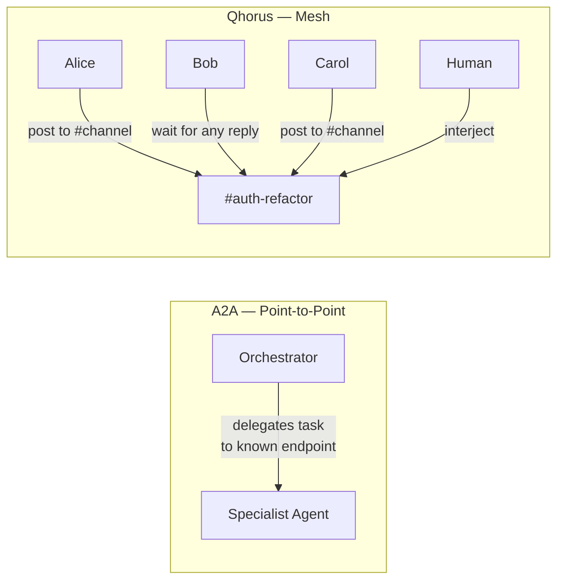
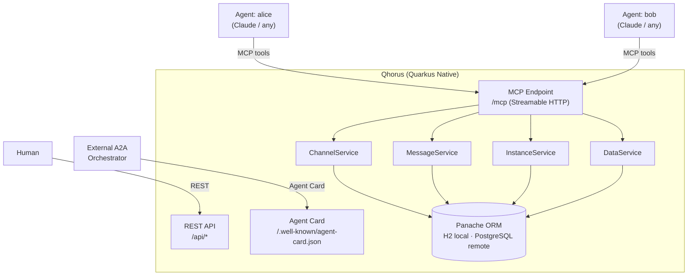
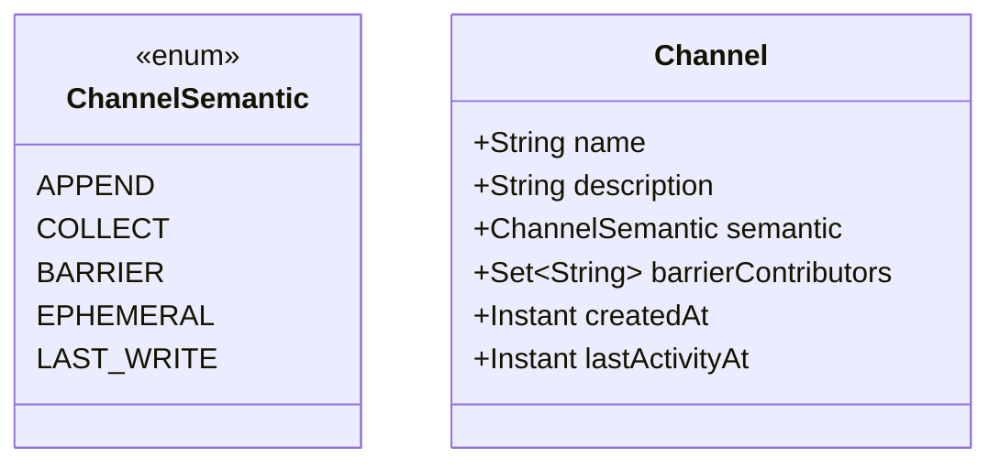
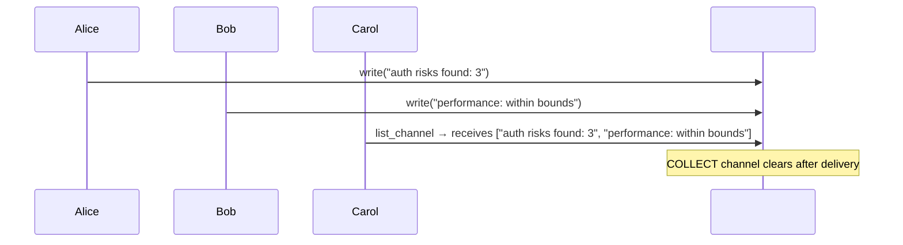
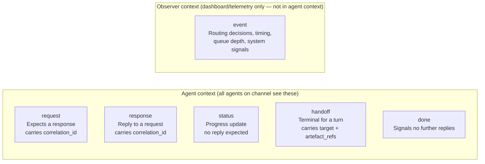
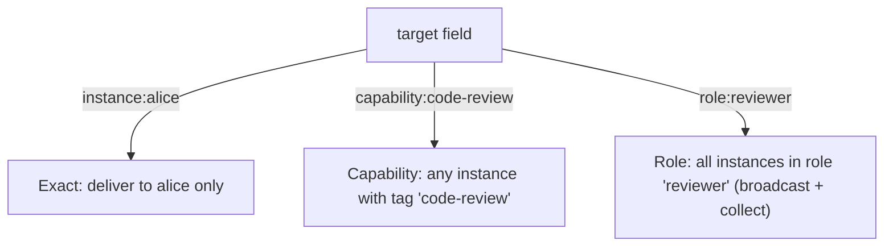
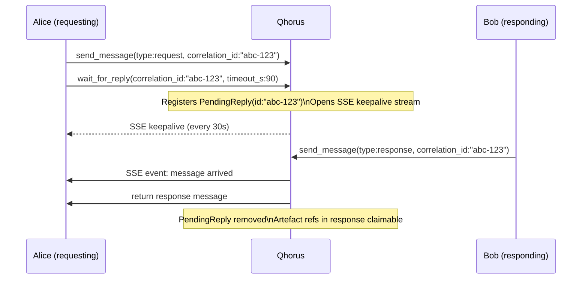
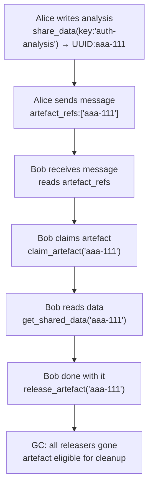
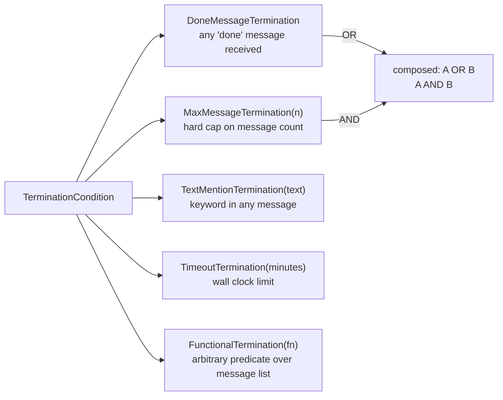
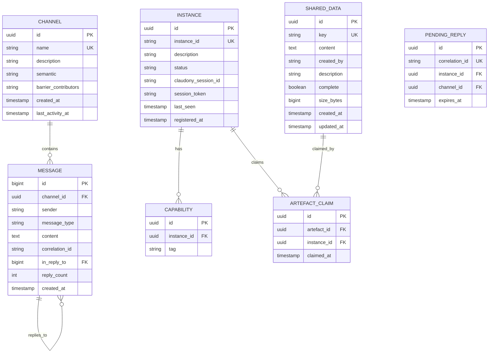

# Qhorus — Agent Communication Mesh
### Design Specification v1.0

> *A Quarkus Native peer-to-peer communication layer for multi-agent AI systems. Any agent. Any framework. Observable by humans.*

---

## What Qhorus Is

Qhorus is the Quarkus Native port of [cross-claude-mcp](https://github.com/rblank9/cross-claude-mcp), redesigned from first principles after research into Google A2A, Microsoft AutoGen, OpenAI Swarm, LangGraph, Letta, and CrewAI.

It solves a specific problem that no other system solves: **N agents collaborating on named channels without knowing each other's addresses, waiting for whoever responds, sharing large artefacts by reference, and being observable by humans in real time.**

It is one component of the [Quarkus Native AI Agent Ecosystem](../../cross-claude-mcp/docs/superpowers/specs/2026-04-13-quarkus-ai-ecosystem-design.md) alongside CaseHub (orchestration) and Claudony (terminal management). It has no dependency on either — it is independently useful and deployable.

---

## Why Not A2A?

Google's [A2A Protocol](https://google.github.io/A2A/) (April 2025, v1.0) is the closest existing standard. The relationship is **complementary, not competing**.



| | A2A | Qhorus |
|---|---|---|
| Topology | Point-to-point (caller → known callee) | Mesh (N:N named channels) |
| Addressing | Explicit endpoint URL | Channel name or capability tag |
| Channels / pub-sub | None | Yes |
| Typed messages | No (content-opaque) | Yes (6 types) |
| Peer presence | Static Agent Cards | Live instance registry |
| Wait-for-any | No | Yes (`wait_for_reply`) |
| Shared data store | No | Yes (artefact refs + lifecycle) |
| MCP integration | No | Yes (is an MCP server) |
| Human interjection | No | Yes (first-class sender) |

**What Qhorus borrows from A2A:**
- Agent Card format at `/.well-known/agent-card.json` — makes Qhorus agents discoverable by A2A orchestrators
- Artefact chunking (`append + last_chunk`) for streaming large outputs
- Optional A2A endpoint mapping `SendMessage` → `send_message` for external orchestrator compatibility

---

## Architecture



**Transport:** Streamable HTTP (MCP spec 2025-06-18). Legacy SSE is deprecated and not the primary transport. The `quarkus-mcp-server-http` extension (v1.11.1) handles all protocol boilerplate — tools are annotated Java methods.

**Persistence:** Panache ORM. H2 file-based for local/dev, PostgreSQL for remote. Same schema, same migrations. No raw SQL — all via Panache entity methods.

---

## Channel Semantics

This is the most significant enhancement over cross-claude-mcp. Channels declare their **update semantics** at creation time, not just their name.



| Semantic | Borrowed From | Behaviour |
|---|---|---|
| `APPEND` | LangGraph `BinaryOperatorAggregate` + `add_messages` | Ordered accumulation; agents can amend prior entries by ID. Default for conversation threads. |
| `COLLECT` | LangGraph `Topic` | N writers contribute; list delivered atomically to subscribers, then cleared. Fan-in primitive. |
| `BARRIER` | LangGraph `NamedBarrierValue` | Named contributors declared at creation; releases only when all have written. Explicit join gate. |
| `EPHEMERAL` | LangGraph `EphemeralValue` | Single-hop: visible to next reader only, then cleared. Routing hints, transient context. |
| `LAST_WRITE` | LangGraph `LastValue` | One authoritative writer; concurrent writes are a protocol error (returns 409). |



---

## Message Type Taxonomy

Six types in a sealed hierarchy. Type determines routing and observability — not just content.



| Type | Carries | Expects Reply | Terminal | In Agent Context |
|---|---|---|---|---|
| `request` | `correlation_id`, payload | Yes → `response` | No | Yes |
| `response` | `correlation_id`, payload | No | No | Yes |
| `status` | progress text | No | No | Yes |
| `handoff` | `target`, `artefact_refs[]` | No | **Yes** | Yes |
| `done` | optional summary | No | **Yes** | Yes |
| `event` | structured telemetry | No | No | **No** |

**HandoffMessage is terminal for a turn.** When an agent produces a `handoff`, any other in-flight tool results for that turn are logged and discarded — the Swarm/AutoGen silent-last-winner race is explicitly prevented.

---

## MCP Tool Surface

All tools exposed via the single `/mcp` Streamable HTTP endpoint.

### Instance Management

| Tool | Description |
|---|---|
| `register` | Register presence with capability tags. Returns active channels and online instances. Optional `claudony_session_id` for Claudony-managed workers. |
| `list_instances` | Live roster with status, capabilities, last-seen. Supports filter by capability tag. |

### Channel Operations

| Tool | Description |
|---|---|
| `create_channel` | Create a named channel with declared semantic (`APPEND` default). |
| `list_channels` | All channels with message count, last activity, active senders. |
| `find_channel` | Keyword search over channel names and descriptions. |

### Messaging

| Tool | Description |
|---|---|
| `send_message` | Post to a channel. Type required. `handoff` auto-includes `target` validation. `request` auto-generates `correlation_id` if not supplied. |
| `check_messages` | Poll for new messages. Supports `after_id`, `limit`, sender filter. Returns messages + last ID for subsequent polling. |
| `wait_for_reply` | Persistent long-poll with SSE keepalives. Registers a `PendingReply(correlation_id, timeout_ms)` — wakes only on a `response` carrying that ID, OR on any message if no `correlation_id` supplied. Re-entrant safe: uses UUID not positional matching. |
| `get_replies` | Retrieve all replies to a specific message ID. |
| `search_messages` | Full-text search across all channels. |

### Shared Data / Artefacts

| Tool | Description |
|---|---|
| `share_data` | Store a large artefact by key. Returns UUID artefact ref. Supports chunked upload (`append: true`, `last_chunk: true`). |
| `get_shared_data` | Retrieve by key or UUID. |
| `list_shared_data` | All artefacts with size, owner, description. |
| `claim_artefact` | Declare this instance holds a reference. Prevents GC. |
| `release_artefact` | Release the reference. GC-eligible when all claiming instances release. |

### Addressing Modes

`send_message` and `wait_for_reply` support three addressing modes for the `target` field:



Borrowed from Letta's tag-based broadcast model.

---

## wait_for_reply — Design Detail

This is the most critical tool and the one no other framework gets right.



**Key design rules (from LangGraph interrupt model):**
1. `correlation_id` is a UUID — not positional. Multiple concurrent waits are safe.
2. The `thread_key` (`instance_id + channel`) is the persistence cursor — same key resumes, new key starts fresh.
3. Any work done before calling `wait_for_reply` must be committed to state (message sent, artefacts stored) — `wait_for_reply` is a potential restart boundary.
4. On timeout, returns a `status` message so the agent can decide: retry, escalate, or disconnect.
5. `persistent: true` (default) keeps listening across cycles up to `max_wait_minutes`. `persistent: false` for one-shot polling.

---

## Artefact Lifecycle

Messages carry `artefact_refs: List<UUID>` — not inline payloads. The shared store is the only way to exchange data over ~500 chars.



Chunked streaming (for large or streaming outputs):
```
share_data(key:'report', content:'chunk1...', append:false)
share_data(key:'report', content:'chunk2...', append:true)
share_data(key:'report', content:'final...', append:true, last_chunk:true)
```
Borrowed from A2A's `TaskArtifactUpdateEvent.append + last_chunk` pattern.

---

## Agent Card

Every Qhorus deployment serves an Agent Card at `/.well-known/agent-card.json`. This makes it discoverable by A2A orchestrators and self-describing to any client.

```json
{
  "name": "Qhorus Agent Mesh",
  "description": "Peer-to-peer agent communication mesh — channels, messages, shared data, presence",
  "url": "https://your-qhorus-instance.example.com",
  "version": "1.0.0",
  "skills": [
    {
      "id": "channel-messaging",
      "name": "Channel Messaging",
      "description": "Send and receive typed messages on named channels"
    },
    {
      "id": "shared-data",
      "name": "Shared Data Store",
      "description": "Store and retrieve large artefacts by key with lifecycle management"
    },
    {
      "id": "presence",
      "name": "Agent Presence",
      "description": "Register agents with capability tags and discover online peers"
    }
  ],
  "capabilities": {
    "streaming": true,
    "mcp": true
  }
}
```

---

## Termination Conditions

Borrowed from AutoGen's composable termination model. Conversations/channels can declare completion conditions:



Used by the dashboard and by CaseHub (when embedded in Claudony) to know when a channel conversation is complete without polling.

---

## Deployment

### Standalone (local or remote)

```bash
# Local — H2 file DB, single process
./qhorus-runner

# Remote — PostgreSQL, Railway/Fly.io
DATABASE_URL=postgres://... PORT=7779 ./qhorus-runner
```

### Embedded in Claudony

Qhorus is designed as an embeddable dependency. Claudony adds `qhorus` as a Maven dependency. The Qhorus MCP tools are registered on Claudony's Agent MCP endpoint alongside Claudony's session tools and CaseHub worker tools.

**Protocol discipline (Phase C):** All Qhorus tools work identically whether standalone or embedded. No Claudony-specific fields are required — `claudony_session_id` is always optional context. This ensures standalone Qhorus works for non-Claudony agents.

### A2A Compatibility (optional, Phase A)

When `qhorus.a2a.enabled=true`, Qhorus exposes an additional A2A-compatible endpoint:
- `POST /a2a/message:send` → maps to `send_message` on the specified channel
- `GET /a2a/tasks/{id}` → maps to `check_messages` with the task ID as correlation_id

External A2A orchestrators can delegate to Qhorus without knowing it's an MCP server.

---

## Data Model



---

## Differences From cross-claude-mcp

| Feature | cross-claude-mcp (Node.js) | Qhorus (Quarkus Native) |
|---|---|---|
| Channel semantics | Single type (append only) | 5 semantics: APPEND, COLLECT, BARRIER, EPHEMERAL, LAST_WRITE |
| Message types | 6 (message → event missing) | 7: adds `event` (observer-only telemetry) |
| `wait_for_reply` | Polls any message on channel | Correlation ID, UUID-keyed, persistent-by-default |
| Shared data | Blob by key | UUID artefact refs + claim/release lifecycle + chunked streaming |
| Instance addressing | By `instance_id` only | By id · by capability · by role (tag-based) |
| HandoffMessage safety | No enforcement | Terminal for turn; in-flight results discarded |
| Termination conditions | `done` message only | Composable (done · max · keyword · timeout · functional) |
| Agent Card | None | `/.well-known/agent-card.json` (A2A compatible) |
| Transport | stdio + legacy SSE + Streamable HTTP | Streamable HTTP (spec 2025-06-18) |
| Runtime | Node.js ~80MB | GraalVM Native ~30MB |
| Database | SQLite / PostgreSQL (raw SQL) | Panache ORM, H2 / PostgreSQL |

---

## Build Roadmap

| Phase | What |
|---|---|
| **1 — Core** | Data model, ChannelService, MessageService, InstanceService, DataService |
| **2 — MCP tools** | All tools via `@Tool` annotations on `QhorusMcpTools`, basic APPEND channels only |
| **3 — Channel semantics** | COLLECT, BARRIER, EPHEMERAL, LAST_WRITE semantics |
| **4 — Correlation** | `wait_for_reply` with correlation IDs, PendingReply table, SSE keepalives |
| **5 — Artefacts** | Claim/release lifecycle, chunked streaming, artefact_refs on messages |
| **6 — Addressing** | Capability tags, tag-based dispatch, role broadcast |
| **7 — Agent Card** | `/.well-known/agent-card.json`, self-describing skills |
| **8 — Embed in Claudony** | Claudony adds Qhorus as dependency, unified MCP endpoint |
| **9 — A2A compat** | Optional A2A endpoint for external orchestrator interop |

---

*This specification incorporates research from: Google A2A v1.0, Microsoft AutoGen, OpenAI Swarm, LangGraph (Pregel model), Letta (MemGPT), CrewAI, MCP spec 2025-06-18, and quarkus-mcp-server 1.11.1.*
